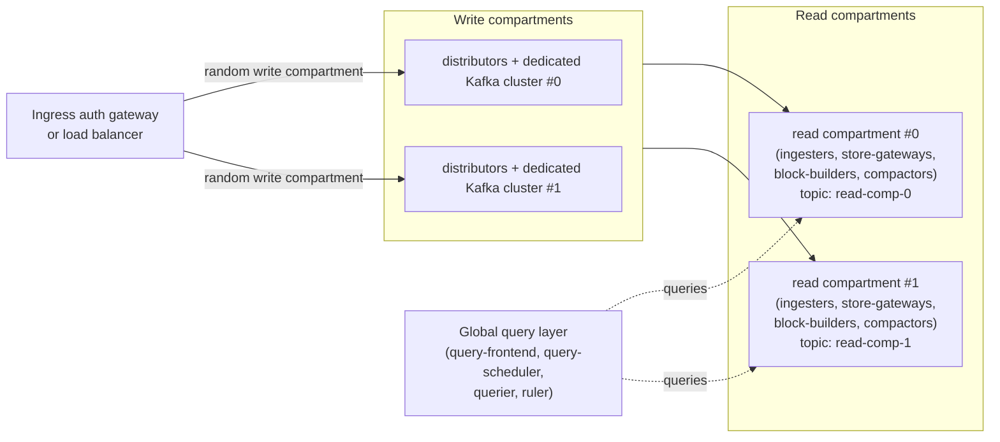

# Mimir compartments

Compartments are an experimental Mimir architecture that shards a single Mimir cell into independent
**sub-cells**, so that a very large tenant can be served by one cell while keeping failure and scaling
domains smaller.

This directory documents the design and the rationale behind it. Start here, then follow the index at
the bottom.

> Status: compartments are experimental and disabled by default. Only part of the architecture is
> built today. See [Status and limitations](./status-and-limitations.md) for what currently works.

## Why compartments

Large cells are avoided for operational manageability and to limit the blast radius of a cell-wide
outage. At Grafana Labs, a new cell is typically created as a cell approaches roughly 1 billion active
series. This works well for cells made of many small tenants, but not for single-tenant cells, nor for
cells dominated by a single very large tenant.

Some customers prefer to keep all their metrics in a single tenant, because it makes cross-cutting
queries easier and integrates better with the rest of the Grafana Labs products. The design goal is to
comfortably run a single tenant on the order of 10 billion active series in a single cell.

Load testing the ingestion path showed it could not run stably much beyond roughly half that target
without sharding the ingestion-path components — which is what the compartments architecture does.

Two main things motivate compartments:

- **Blast radius.** Today a cell has a single shared ingestion backbone: one Kafka topic, one partition
  ring, and one pool of ingesters consuming from it. A problem in the ingestion or query path affects
  _every_ series in the cell, because everything flows through the same topic and the same pool of
  ingesters. There is no isolation boundary smaller than the whole cell.
- **Scaling limits.** A single partition ring and a single topic have practical ceilings. Past a
  certain scale, "just add more partitions" becomes a scaling problem in itself.

Compartments address both by splitting the ingestion path into independent slices: each series is
deterministically routed to a compartment, and each compartment has its own topic and its own partition
ring. A problem in one compartment is contained to the fraction of series routed to it, and each
compartment can be scaled and operated independently.

## Terminology

A **compartment** is a group of pods that handles a slice of a cell's load. All compartment pods run in
the same namespace but are managed by separate Deployments and StatefulSets.

There are two independent sets of compartments, and their counts do not need to match:

- **Write compartments** — the ingestion-side pools: distributors plus a **dedicated Kafka cluster**
  (Kafka is segregated per write compartment; at Grafana Labs this is a Warpstream cluster, but it can
  be Kafka brokers).
- **Read compartments** — the metric-storage components: ingesters, store-gateways, block-builders and
  compactors.

A **global query layer** — query-frontend, query-scheduler, querier and ruler — spans all compartments
and is not part of either set.

## Overall architecture

At a high level:

- **Write path.** An ingress auth gateway (or a load balancer) forwards a write request to a random
  distributor in a random write compartment. The distributor shards each series first by read
  compartment, then by partition within that compartment.
- **Sharding.** Write requests are spread randomly across write compartments. Series are sharded to read
  compartments by metric name, and then to a partition within the compartment using the existing
  series label-hash sharding. See [Sharding](./sharding.md).
- **Read path.** Each read compartment runs its storage components against a dedicated topic.

> **Note:** compartments are still under development and not everything described in this
> documentation is implemented yet. See [Status and limitations](./status-and-limitations.md) for the
> current state.

## Multi-zone

The architecture preserves multi-availability-zone deployments by deploying each compartment's
components (both write and read compartments) across availability zones.

## Index

- [Sharding](./sharding.md) — how series are sharded to compartments and partitions, and why the
  metric name is used as the segmentation label.
- [Write compartments](./write-compartments.md) — the write-compartment design.
- [Read compartments](./read-compartments.md) — the read-compartment design.
- [Configuration](./configuration.md) — the rationale behind where compartments configuration lives.
- [Status and limitations](./status-and-limitations.md) — what is implemented today and what is not.
- [Authoring guide for the compartments documentation](./AGENTS.md) — rules for keeping this
  documentation up to date.
