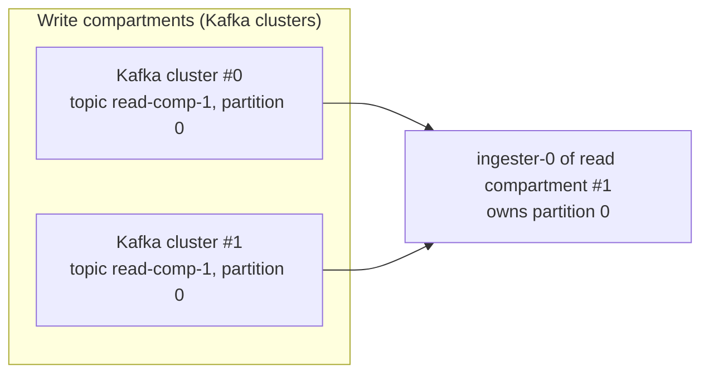

# Read compartments

> This describes the target architecture. For what is implemented today, see
> [Status and limitations](./status-and-limitations.md).

A read compartment is the metric-storage side of a compartment. It runs its own ingesters,
store-gateways, block-builders and compactors, and is responsible for the series sharded to it.

## How it works

- Each read compartment uses a **dedicated topic**. Partition 0 of read compartment 0 and partition 0
  of read compartment 1 are different topic-partitions, so partition ownership is naturally scoped per
  compartment.
- Each read compartment has its **own partition ring**, and an ingester owns a partition of its read
  compartment. Each read compartment scales horizontally and independently of the others, so a read
  compartment can have a different number of partitions than another.
- An ingester consumes its partition from **every** write compartment's Kafka cluster, because every
  write compartment writes to every read compartment Kafka topic (in a different Kafka cluster).

## Why a dedicated topic per read compartment

A dedicated topic per read compartment simplifies partition management: each compartment's partitions
are an independent topic, so there is a clear, per-compartment mapping between a partition and the
ingester that owns it.

For example, with two read compartments there are two topics, `read-comp-0` and `read-comp-1`. The
ingester that owns partition 0 of read compartment 0 consumes `read-comp-0` partition 0, while the
ingester that owns partition 0 of read compartment 1 consumes `read-comp-1` partition 0 — two distinct
topic-partitions owned by two distinct ingesters, even though both are "partition 0".

## Warpstream specifics

At Grafana Labs the per-write-compartment Kafka clusters are Warpstream clusters. The following points
are specific to Warpstream; the design above is Kafka-cluster-generic.

- **Read agents run (logically) in write compartments, not read compartments.** There is one read-agent
  pool per Warpstream virtual cluster (VC), and VCs are driven by write compartments. An ingester
  consuming a partition across all VCs connects to one read agent per write compartment, so the number
  of direct ingester-to-read-agent connections stays limited.
- **Read-agent distributed caching.** Warpstream read agents build a distributed in-memory cache and can
  fetch portions of files from one another. As a result, consuming a partition across all VCs may, under
  the hood, require data from any read agent in any write compartment. This is a potential scalability
  and availability limitation that needs further investigation.
- **Cross-VC consumption ordering.** An ingester consumes from multiple VCs, and consumption from each VC
  is independent, so there is no guarantee of in-order consumption across VCs. The plan is to offset this
  by merging the per-VC streams with a heap that orders Kafka records by their creation timestamp.
