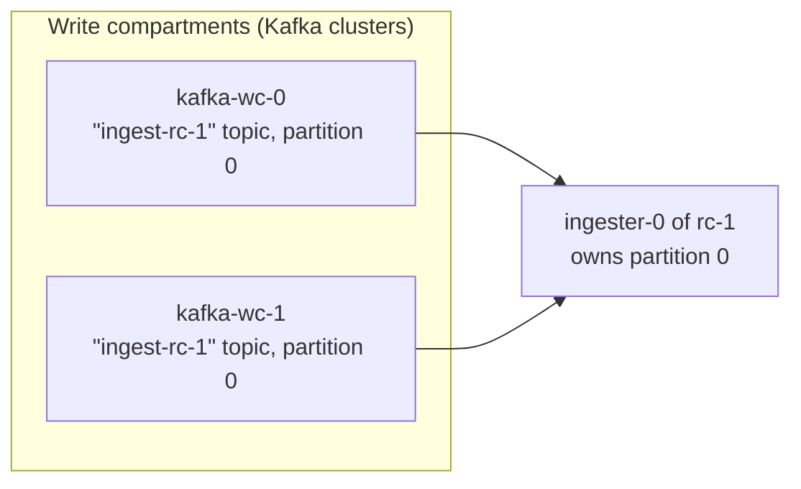

# Read compartments

> This describes the target architecture. For what is implemented today, see
> [Status and limitations](./status-and-limitations.md).

A read compartment is the metric-storage side of a compartment. It runs its own ingesters,
store-gateways, block-builders and compactors, and is responsible for the series sharded to it.

## How it works

- Each read compartment uses a **dedicated topic**. Partition 0 of read compartment 0 and partition 0
  of read compartment 1 are different topic-partitions, so partition ownership is naturally scoped per
  compartment.
- Each read compartment has its **own partition ring**, and an ingester owns a partition of its read
  compartment. Each read compartment scales horizontally and independently of the others, so a read
  compartment can have a different number of partitions than another.
- An ingester consumes its partition from **every** write compartment's Kafka cluster, because every
  write compartment writes to every read compartment Kafka topic (in a different Kafka cluster).

### Spreading consumer resources across write compartments

Some read-compartment components consume from every write compartment's Kafka cluster: ingesters
consume their partition from all of them, and block-builders read the same partition across all of
them to build blocks. Such a component maintains a separate consumer per write compartment, and the
resources dedicated to consumption are divided across these consumers, so the component's total
consumption resource usage stays independent of the number of write compartments instead of growing
with it.

### Ordering records across write compartments

A component that consumes the same partition from every write compartment's Kafka cluster sees each
cluster's stream independently, with no inherent ordering between them. Appending one cluster's records
and then the next's could produce out-of-order samples if the clusters' records overlap in time, since
the second cluster's timestamps then rewind to earlier in the window. To reduce this, the per-cluster
streams can be merged into a single stream ordered by Kafka record timestamp before being consumed.

- **Ingesters** can optionally merge on the live path. A live stream is unbounded, so the merge is
  best-effort within a bounded window.
- **Block-builders** always merge a job's per-cluster ranges this way. Because a job's start and end
  offsets are known up front, the merge sorts exactly across clusters for the window.

## Blocks storage

Each read compartment owns its blocks storage end to end:

- A read compartment has a **dedicated object-storage bucket**. Its ingesters and block-builders
  upload blocks there, its compactors compact the blocks within it, and its store-gateways serve
  queries from it. A compartment's blocks never mix with another compartment's.
- Store-gateways and compactors **run per read compartment**, alongside that compartment's ingesters.
- Each read compartment has its **own store-gateway ring** and its **own compactor ring**. Block
  sharding and replication across store-gateways, and compaction-job sharding across compactors, are
  therefore scoped within a compartment: a store-gateway or compactor only owns work for its own
  compartment's blocks.

This is the storage-side expression of the blast-radius and scaling goals (see
[Mimir compartments](./README.md)): a bucket-level problem — for example object-storage rate limiting
or a corrupt block — is contained to one compartment, and each compartment's storage components and
bucket scale independently of the others.

The global query layer queries each read compartment's store-gateways the same way it queries that
compartment's ingesters: it narrows a query to the compartments that can hold the selected metric
names and fans out otherwise (see [Querying read compartments](#querying-read-compartments)).

## Block-builders

Each read compartment runs its own block-builder scheduler and pool of block-builders. The scheduler
monitors the compartment's topic across every write compartment's Kafka cluster and cuts jobs; the
block-builders consume those clusters, build the compartment's blocks, and upload them to its bucket.

- **One job can span every write compartment.** A job is scoped to one partition but carries a separate
  offset range per cluster, built into a single block with the ranges merged in record-timestamp order.
  Scoping a job to a single cluster instead would produce a separate block per cluster for the same
  window, multiplying blocks and chunks by roughly the number of write compartments until compaction
  merges them away — raising object-storage cost and query load, since store-gateways then load more
  blocks per query.
- **A job is all-or-nothing across its clusters.** The block-builder reads every cluster's range
  together, and if any read fails the whole job is retried, so committed offsets never advance past
  unread data. One unhealthy write compartment therefore blocks the compartment's block building until
  it recovers — acceptable because block building is delayed (store-gateways don't need a block for
  hours) and no worse than a single Kafka cluster being down without compartments.
- **Backlog reconstruction on restart.** As in non-compartments mode, on restart the scheduler rebuilds
  the backlog from what already sits in Kafka — probing historical offsets and replaying them by
  timestamp to reproduce the job boundaries it would have cut live. The compartment difference is that
  the probed offsets from every cluster are grouped by time, so data ingested around the same time
  across clusters lands in the same job, keeping one block per window.

## Querying read compartments

The global query layer queries the ingesters of read compartments through the same path used without
compartments, extended to be compartment-aware. Because series are sharded to read compartments by
metric name (see [Sharding](./sharding.md)), the layer narrows a query to only the compartments that
can hold the selected series:

- **When the query pins a single metric name** — that is, it filters the metric name with an equality
  matcher — all of its series live in exactly one compartment, so only that compartment's ingesters are
  queried.
- **When the query restricts the metric name to a finite set** — for example a regex matcher equivalent
  to an alternation like `a|b|c` — the query is sent to the union of the compartments owning those
  names, which can still be a subset of all compartments.
- **Otherwise** — whenever the metric name can't be reduced to a finite set of names (no metric-name
  equality matcher and no enumerable regex, for example an open-ended regex like `.+`) — the query fans
  out to **every** compartment and the results are merged. Metadata and whole-tenant statistics queries,
  which carry no metric-name filter, always fan out.

This targeting is what delivers the query blast-radius reduction: a problem in one compartment only
affects queries whose metric name routes to it, while queries for other metric names are unaffected.

Targeting relies on the read-compartment count being **static**: the metric-name-to-compartment mapping
must match the one used on the write path, so a query reads from the same compartment the series were
written to. Changing the number of compartments would shift that mapping and is out of scope.

## Why a dedicated topic per read compartment

A dedicated topic per read compartment simplifies partition management: each compartment's partitions
are an independent topic, so there is a clear, per-compartment mapping between a partition and the
ingester that owns it.

For example, with two read compartments there are two topics, `ingest-rc-0` and `ingest-rc-1`. The
ingester that owns partition 0 of rc-0 consumes `ingest-rc-0` partition 0, while the
ingester that owns partition 0 of rc-1 consumes `ingest-rc-1` partition 0 — two distinct
topic-partitions owned by two distinct ingesters, even though both are "partition 0".

## Warpstream specifics

At Grafana Labs the per-write-compartment Kafka clusters are Warpstream clusters. The following points
are specific to Warpstream; the design above is Kafka-cluster-generic.

- **Read agents run (logically) in write compartments, not read compartments.** There is one read-agent
  pool per Warpstream virtual cluster (VC), and VCs are driven by write compartments. An ingester only
  consumes a single partition from each VC, and consuming a single partition requires connecting to only
  one read agent, so an ingester connects to exactly one read agent per write compartment. This bounds the
  number of direct ingester-to-read-agent connections to the number of write compartments.
- **Read-agent distributed caching.** Warpstream read agents build a distributed in-memory cache and can
  fetch portions of files from one another. As a result, consuming a partition across all VCs may, under
  the hood, require data from any read agent in any write compartment. This is a potential scalability
  and availability limitation that needs further investigation.
