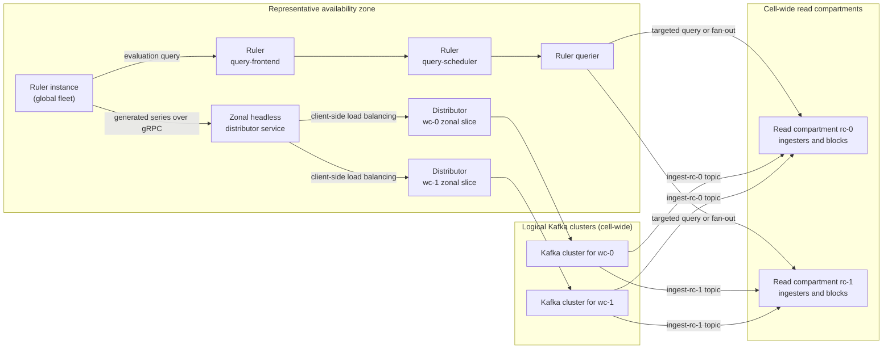

# Ruler

The ruler is part of the global query layer. It runs as one multi-zone fleet for the cell, rather than
as part of a read or write compartment. Ruler instances use a single global ring to shard rule groups
and read rule groups from shared ruler storage.

## Evaluating rules

Rulers use remote rule evaluation. A ruler sends each evaluation to the ruler query-frontend in its
availability zone. The query passes through the ruler query-scheduler to a ruler querier, which queries
read compartments using the same targeting and fan-out behavior as other queries (see
[Read compartments](./read-compartments.md#querying-read-compartments)).

A rule expression can read from one read compartment or fan out to several. The compartment that holds
the input series does not determine where the result is stored: generated series are routed separately,
using their own metric names.

## Writing rule results

After evaluating a recording or alerting rule, the ruler sends the generated series over gRPC to a
headless distributor service in the ruler's availability zone. The service exposes distributors from
every write compartment in that zone, and gRPC client-side load balancing selects an endpoint for each
request.

The selected distributor sends the request through its write compartment's Kafka cluster. It shards each
generated series to a read compartment by tenant and metric name, and then to a partition by series
labels, just like any other write (see [Sharding](./sharding.md)). Consequently, a rule can read series
from one set of read compartments and write its result to another read compartment.

The diagram shows two read compartments and two write compartments only as an example. Both types of
compartment span availability zones, their counts are independent, and there is no one-to-one pairing
between them. The ruler, ruler query path and distributor slices shown inside the zone are repeated in
every availability zone, while each write compartment has one logical, cell-wide Kafka cluster.

In a compartments deployment, rulers do not run an internal distributor for rule-result writes. Rule
expression evaluation and result ingestion are separate steps: PromQL expression evaluation can succeed,
but if the result write fails, the rule is reported unhealthy and an evaluation failure is recorded.
Alertmanager notifications continue to use the existing notification path and are not routed through
compartments.

## Why rulers are global

Deploying rulers in a single write compartment would direct all rule-result requests to that compartment.
Spreading rulers across read compartments and assigning each to a write compartment does not map cleanly,
because read and write compartment counts are independent.

Rulers remain in the global layer and send each result-write request through the zonal distributor service.
Client-side load balancing selects one distributor endpoint from a pool containing the zonal slices of all
write compartments. The selected distributor then applies the normal read-compartment and partition
sharding.

The tradeoff is that compartments do not isolate ruler scheduling and evaluation: a fleet-wide problem
can affect rules whose queries would otherwise target different read compartments. Read compartments
still limit the data-path impact when a rule expression can be targeted to a subset of them.
