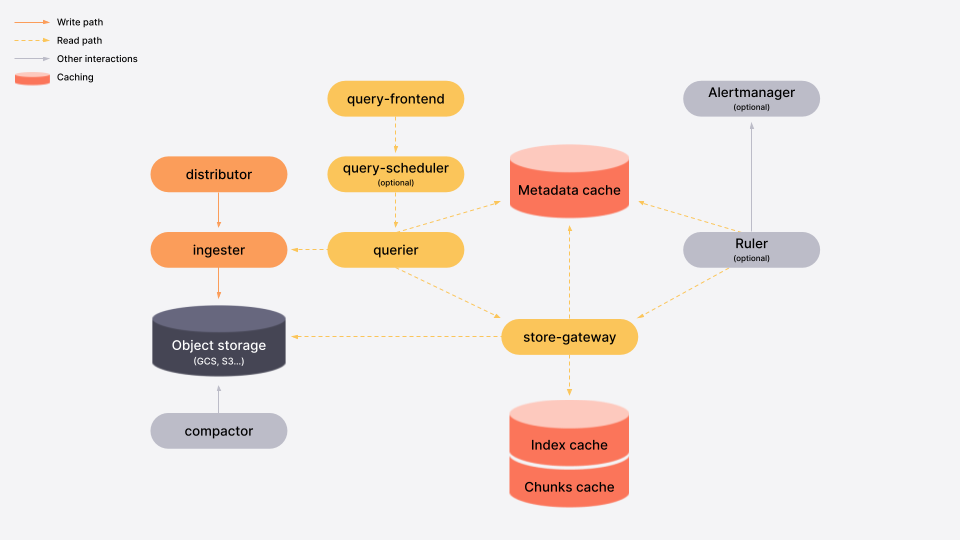

# About the architecture

Grafana Mimir has a service-based architecture.
The system has multiple horizontally scalable microservices that run separately and in parallel.

<!-- Diagram source at https://docs.google.com/presentation/d/1bHp8_zcoWCYoNU2AhO2lSagQyuIrghkCncViSqn14cU/edit -->

## Microservices

Most microservices are stateless and don't require any data persisted between process restarts.

Some microservices are stateful and rely on non-volatile storage to prevent data loss between process restarts.

A dedicate page describes each microservice in detail.

``

<!-- START from blocks storage -->
### The write path

**Ingesters** receive incoming samples from the distributors. Each push request belongs to a tenant, and the ingester appends the received samples to the specific per-tenant TSDB stored on the local disk. The received samples are both kept in-memory and written to a write-ahead log (WAL) and used to recover the in-memory series in case the ingester abruptly terminates. The per-tenant TSDB is lazily created in each ingester as soon as the first samples are received for that tenant.

The in-memory samples are periodically flushed to disk - and the WAL truncated - when a new TSDB block is created, which by default occurs every 2 hours. Each newly created block is then uploaded to the long-term storage and kept in the ingester until the configured `-blocks-storage.tsdb.retention-period` expires, in order to give [queriers](./querier.md) and [store-gateways](./store-gateway.md) enough time to discover the new block on the storage and download its index-header.

In order to effectively use the **WAL** and being able to recover the in-memory series upon ingester abruptly termination, the WAL needs to be stored to a persistent disk which can survive in the event of an ingester failure (ie. AWS EBS volume or GCP persistent disk when running in the cloud). For example, if you're running the Mimir cluster in Kubernetes, you may use a StatefulSet with a persistent volume claim for the ingesters. The location on the filesystem where the WAL is stored is the same where local TSDB blocks (compacted from head) are stored and cannot be decoupled. See also the [timeline of block uploads](production-tips/#how-to-estimate--querierquery-store-after) and [disk space estimate](production-tips/#ingester-disk-space).

#### Distributor series sharding and replication

Due to the replication factor N (typically 3), each time series is stored by N ingesters, and each ingester writes its own block to the long-term storage. [Compactor](./compactor.md) merges blocks from multiple ingesters into a single block, and removes duplicate samples. After blocks compaction, the storage utilization is significantly reduced.

For more information, see [Compactor](./compactor.md) and [Production tips](./production-tips.md).

### The read path

[Queriers](./querier.md) and [store-gateways](./store-gateway.md) periodically iterate over the storage bucket to discover blocks recently uploaded by ingesters.

For each discovered block, queriers only download the block's `meta.json` file (containing some metadata including min and max timestamp of samples within the block), while store-gateways download the `meta.json` as well as the index-header, which is a small subset of the block's index used by the store-gateway to lookup series at query time.

Queriers use the blocks metadata to compute the list of blocks that need to be queried at query time and fetch matching series from the store-gateway instances holding the required blocks.

For more information, please refer to the following dedicated sections:
<!-- END from blocks storage -->
