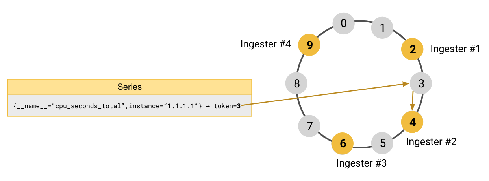
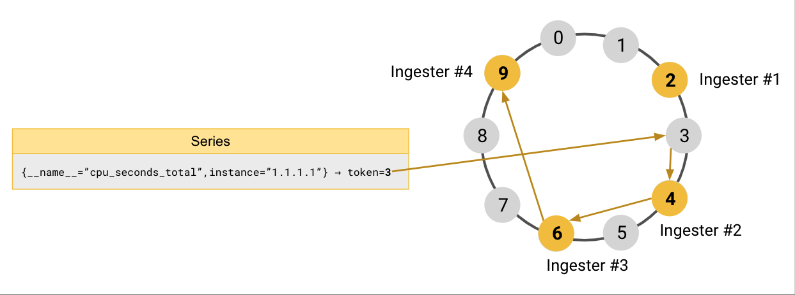

# About the hash ring

The hash ring is a distributed hashing scheme used by Grafana Mimir for sharding and replication.

## How the hash ring works in Grafana Mimir

Grafana Mimir uses a hashing function that returns 32-bit unsigned integers.
The result of the hashing function is called a _token_ and it's a value between `0` and `(2^32)-1` inclusive.
The token is used to lookup which Grafana Mimir instance is the authoritative owner of the hashed data.

For example, series are sharded across [ingesters]().
The token of a given series is computed by hashing all of the series’ labels: the result of which is an unsigned 32-bit integer within the space of the tokens.
The ingester that owns that series is the instance that owns the range of the tokens, including the series' token.

To divide up the tokens’ space across the available instances within the cluster, all of the running instances of a given Grafana Mimir component, such as the ingesters, join a hash ring.
The hash ring is a data structure that splits the space of the tokens into multiple ranges, and assigns each range to a given Grafana Mimir ring member.

Upon startup, a Grafana Mimir instance generates random tokens, and it registers them into the ring.
A token is owned by the instance that registered the smallest token that is larger than the one being looked up.

To replicate the data across multiple instances, Grafana Mimir finds the replicas by starting from the authoritative owner of the data and walking the ring clockwise.
Data is replicated to the next instances found while walking the ring.

### A practical example

To better understand how it works, take four ingesters and a tokens space between `0` and `9` as an example:

- Ingester #1 is registered in the ring with the token `2`
- Ingester #2 is registered in the ring with the token `4`
- Ingester #3 is registered in the ring with the token `6`
- Ingester #4 is registered in the ring with the token `9`

Grafana Mimir receives an incoming sample for the series `{__name__="cpu_seconds_total",instance="1.1.1.1"}`.
It hashes the series’ labels, and the result of the hashing function is the token `3`.

To find which ingester owns token `3`, Grafana Mimir looks up the token `3` in the ring and finds the ingester that is  registered with the smallest token larger than `3`.
The ingester #2, which is registered with token `4`, is the authoritative owner of the series `{__name__="cpu_seconds_total",instance="1.1.1.1"}`.

[//]: # "Diagram source at https://docs.google.com/presentation/d/1bHp8_zcoWCYoNU2AhO2lSagQyuIrghkCncViSqn14cU/edit"

Grafana Mimir replicates each series to three ingesters by default.
After finding the authoritative owner of the series, Grafana Mimir keeps walking the ring clockwise to find the remaining two instances where the series should be replicated.
In our example, the ingester #3 and ingester #4 are the instances where the series is replicated to.

[//]: # "Diagram source at https://docs.google.com/presentation/d/1bHp8_zcoWCYoNU2AhO2lSagQyuIrghkCncViSqn14cU/edit"

### Consistent hashing

The hash ring guarantees the consistent hashing property.

When an instance is added or removed from the ring, the number of tokens which moves from an instance to another one is reduced to the minimum.
On average, the number of tokens that need to move to a different instance is only `n/m` where `n` is the total number of tokens (32-bit unsigned integer) and `m` is the number of instances registered in the ring.

## Which Grafana Mimir components use the hash ring

There are multiple Grafana Mimir components that need an hash ring.
Each of these components builds an independent hash ring:

- [Ingesters](): used to shard and replicate series.
- [Distributors](): used to enforce rate limits.
- [Compactors](): used to shard compaction workload.
- [Store-gateways](): used to shard blocks to query from long-term storage.
- [(Optional) Rulers](): used to shard rule groups to evaluate.
- [(Optional) Alertmanagers](): used to shard tenants.

## Which Grafana Mimir features are built on top of the hash ring

Grafana Mimir primarily uses the hash ring for sharding and replication.
A part from this, other features are built on top of the hash ring:

- **Service discovery**: instances can discover each other looking up who is registered in the ring.
- **Heartbeating**: instances periodically send an heartbeat to the ring to signal they're up and running. An instance is considered unhealthy if misses the heartbeat for some period of time.
- **Zone-aware replication**: zone-aware replication is the replication of data across failure domains and can be optionally enabled in Grafana Mimir. For more information, see [configuring zone-aware replication]().
- **Shuffle sharding**: Grafana Mimir optionally support shuffle sharding in a multi-tenant cluster, to reduce the blast radius of an outage and better isolate tenants. For more information, see [configure shuffle sharding]().

## How the hash ring is shared between Grafana Mimir instances

The hash ring data structure needs to be shared between Grafana Mimir instances.
To propagate the hash ring changes, Grafana Mimir uses a key-value store.
The key-value store is required and can be configured independently for the hash rings of different components.

For more information, see the [key-value store documentation]().
