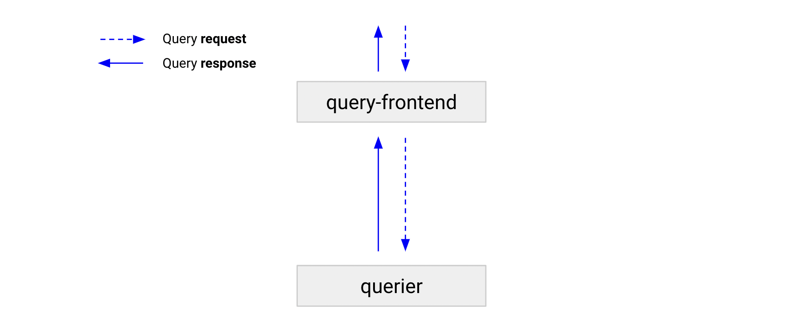

# Query-frontend

The **query-frontend** is a component that provides the same API as the [querier]() and can be used to accelerate the read path. It is not a required component, but we highly recommend deploying it. When the query-frontend is in place, incoming query requests should be directed to the query-frontend instead of the queriers. The queriers are still required within the cluster, in order to execute the actual queries.

The query-frontend internally performs some query adjustments and holds queries in an internal queue. In this setup, queriers act as workers which pull jobs from the queue, execute them, and return their results to the query-frontend for aggregation. Queriers need to be configured with the query-frontend address (via the `-querier.frontend-address` CLI flag) to allow them to connect to the query-frontends.

Query-frontends are **stateless**. However, due to how the internal queue works, it's recommended to run multiple query-frontend replicas to reap the benefit of fair scheduling. Two replicas should suffice as a start.

[//]: # "Diagram source at https://docs.google.com/presentation/d/1bHp8_zcoWCYoNU2AhO2lSagQyuIrghkCncViSqn14cU/edit"

Flow of the query in the system when using query-frontend (_without_ query-scheduler):

1. Query is received by query-frontend. The query-frontend can optionally split or shard it into multiple queries or serve it from the cache.
2. Query frontend stores the query/ies into an in-memory queue, where it waits for some querier to pick it up.
3. Querier picks up the query and executes it. If the query was split or sharded, multiple queriers can pick up the work.
4. Querier(s) send back result to query-frontend, which then aggregate results and forwards it to the client.

## Functions

### Queueing

The query-frontend queuing mechanism is used to:

- Ensure that large queries, that could cause an out-of-memory (OOM) error in the querier, will be retried on failure. This allows administrators to under-provision memory for queries, or optimistically run more small queries in parallel, which helps to reduce the TCO.
- Prevent multiple large requests from being convoyed on a single querier by distributing them across all queriers using a first-in/first-out queue (FIFO).
- Prevent a single tenant from denial-of-service-ing (DOSing) other tenants by fairly scheduling queries between tenants.

### Splitting

The query-frontend can split long-range queries into multiple queries. By default, the split interval is 24 hours. It executes these queries in parallel on downstream queriers and stitches the results back together. This prevents large (multi-day, multi-month) queries from causing out-of-memory errors in a single querier and helps to execute the queries faster.

### Caching

The query-frontend supports caching query results and reuses them on subsequent queries. If the cached results are incomplete, the query-frontend calculates the required partial queries and executes them in parallel on downstream queriers. The query-frontend can optionally align queries with their step parameter to improve the cacheability of the query results[^1]. The result cache is backed by memcached.

[^1]: While this increases the performance of Grafana Mimir, it violates the [PromQL conformance](https://prometheus.io/blog/2021/05/03/introducing-prometheus-conformance-program/) of Grafana Mimir. If PromQL conformance is not a priority, step alignment can be enabled by setting the `-query-frontend.align-querier-with-step=true`.

### Query sharding

The query-frontend also provides [query sharding]().

## Why query-frontend scalability is limited

The query-frontend scalability is limited by the configured number of workers per querier.

When you don't use the [query-scheduler](), the query-frontend stores a queue of queries to execute. A querier runs `-querier.max-concurrent` workers and each worker connects to one of the query-frontend replicas to pull queries to execute. A querier worker executes one query at a time.

The connection from a querier worker to a query-frontend is persistent. After a connection is established, multiple queries are delivered through the connection, one at a time. To balance the number of workers connected to each query-frontend, the querier workers use a round-robin method to select the query-frontend replicas to connect to.

If you run more query-frontend replicas than the number of workers per querier, the querier increases the number of internal workers to match the query-frontend replicas. This ensures that all query-frontends have some of the workers connected.

However, the PromQL engine running in the querier is also configured with a max concurrency equal to `-querier.max-concurrent`.
If the number of querier workers is higher than the PromQL engine max concurrency, a worker might pull a query from the query-frontend but not be able to execute it immediately because the max concurrency has been reached.
The queries exceeding the configured max concurrency create a backlog in the querier until other queries have been executed.

The backlog might cause a suboptimal utilization of querier resources, leading to poor query performance when you run Grafana Mimir at scale.

The [query-scheduler]() is an optional component that you can deploy to overcome the query-frontend scalability limitations.

## DNS Configuration / Readiness

When a query-frontend is first started it does not immediately have queriers attached to it. The [`/ready` endpoint]() returns HTTP 200 status code only when the query-frontend has at least one querier attached and is ready to serve queries. Make sure to configure this endpoint as a healthcheck in your load balancer; otherwise, a query-frontend scale out event might result in failed queries or high latency until queriers connect to the query-frontend.

When using query-frontend with query-scheduler, `/ready` will report HTTP 200 status code only after the query-frontend connects to at least a query-scheduler.
