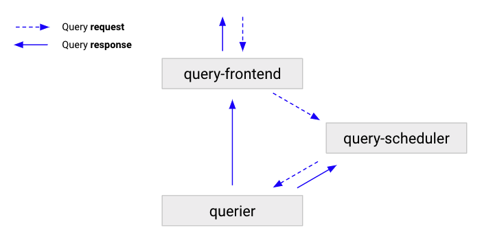

# (Optional) Query-scheduler

The query-scheduler is an optional, stateless component that retains a queue of queries to execute, and distributes the workload to available [queriers]().

[//]: # "Diagram source at https://docs.google.com/presentation/d/1bHp8_zcoWCYoNU2AhO2lSagQyuIrghkCncViSqn14cU/edit"

The following flow describes how a queries moves through a Grafana Mimir cluster:

1. The [query-frontend]() receives queries, and then either splits and shards them, or serves them from the cache.
1. The query-frontend enqueues the queries into a query-scheduler.
1. The query-scheduler stores the queries in an in-memory queue where they wait for a querier to pick them up.
1. Queriers pick up the queries, and executes them.
1. The querier sends results back to query-frontend, which then forwards the results to the client.

## Benefits of using the query-scheduler

Query-scheduler enables the scaling of query-frontends. You might experience challenges when you scale query-frontend. To learn more about query-frontend scalability limits, refer to [Why query-frontend scalability is limited]().

### How query-scheduler solves query-frontend scalability limits

When you use the query-scheduler, the queue is moved from the query-frontend to the query-scheduler, and the query-frontend can be scaled to any number of replicas.

The query-scheduler is affected by the same scalability limits as the query-frontend, but because a query-scheduler replica can handle high amounts of query throughput, scaling the query-scheduler to a number of replicas greater than `-querier.max-concurrent` is typically not required, even for very large Grafana Mimir clusters.

## Configuration

To use the query-scheduler, configure the query-frontends and queriers to connect to the query-scheduler:

- Query-frontend: `-query-frontend.scheduler-address`
- Querier: `-querier.scheduler-address`

> **Note:** The querier pulls queries only from the query-frontend or the query-scheduler, but not both. `-querier.frontend-address` and `-querier.scheduler-address` options are mutually exclusive, and only one option can be set.

## Operational considerations

For high-availability, run two query-scheduler replicas.

If you're running a Grafana Mimir cluster with a very high query throughput, you can add more query-scheduler replicas.
If you scale the query-scheduler, ensure that the number of replicas you add is less or equal than the configured `-querier.max-concurrent`.
