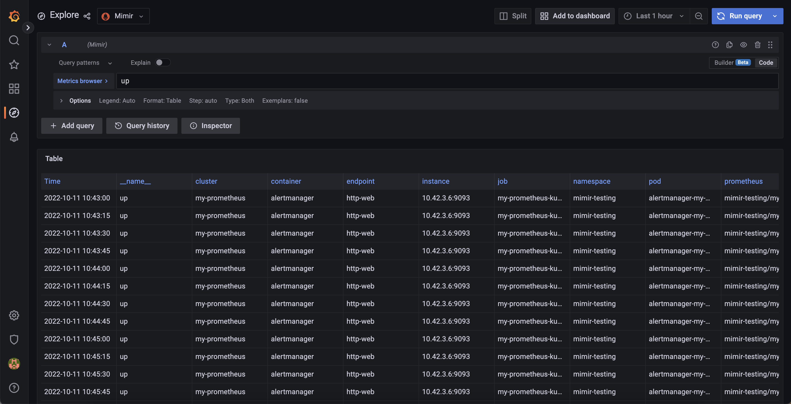

---
aliases:
  - ../configuring/configure-helm-ha-deduplication-consul/
description:
  Learn how to configure the Grafana Mimir Helm chart to handle HA Prometheus
  server deduplication with Consul.
menuTitle: Configure high-availability deduplication with Consul
title:
  Configuring Grafana Mimir-Distributed Helm Chart for high-availability deduplication
  with Consul
weight: 70
---

# Configuring Grafana Mimir-Distributed Helm Chart for high-availability deduplication with Consul

Grafana Mimir can deduplicate data from a high-availability (HA) Prometheus setup. You can configure
the deduplication by using the Grafana Mimir helm chart deployment that uses external Consul. For more information, see [Configure high availability](https://grafana.com/docs/mimir/<MIMIR_VERSION>/configure/configure-high-availability-deduplication/).

## Before you begin

You need to have a Grafana Mimir installed via the mimir-distributed Helm chart.

For conceptual information about how Mimir deduplicates incoming HA samples, refer to [Configure high availability](https://grafana.com/docs/mimir/<MIMIR_VERSION>/configure/configure-high-availability-deduplication/).

You also need to configure HA for Prometheus or Grafana Agent. Lastly, you need a key-value store such as Consul KV.



## Configure Prometheus or Grafana Agent to send HA external labels

Configure the Prometheus or Grafana Agent HA setup by setting the labels named `cluster` and `__replica__`,
which are the default labels for a HA setup in Grafana Mimir. If you want to change the HA labels,
make sure to change them in Mimir as well. This ensures that the configurations of Grafana Mimir, Prometheus, and Grafana Agent all match each other. Otherwise, HA deduplication will not work.

- The value of the `cluster` label must be same across replica that belong to the same cluster.
- The value of the `__replica__` label must be unique across different replica within the same cluster.

```yaml
global:
  external_labels:
    __replica__: replica-1
    cluster: my-prometheus
```

Reload or restart Prometheus or Grafana Agent after you update the configuration.

> **Note:** [Configure high availability](https://grafana.com/docs/mimir/<MIMIR_VERSION>/configure/configure-high-availability-deduplication/).
> document contains the same information on Prometheus setup for HA dedup.

## Install Consul using Helm

To get and install Consul on Kubernetes, use the [Consul helm chart](https://github.com/hashicorp/consul-k8s/tree/main/charts/consul).
Make a note of the Consul endpoint, because you will need it later to configure Mimir.

## Configure Mimir high availability

You can configure Mimir HA deduplication globally or at the tenant level.

### Globally configure HA deduplication

Before you begin, make sure that Mimir was installed using the mimir-distributed Helm chart.

1. Merge the following configuration to your `custom.yaml` file:

```yaml
mimir:
  structuredConfig:
    limits:
      accept_ha_samples: true
      # The following two configurations must match those of external_labels in Prometheus
      # The config values below are the default and can be removed if you don't want to override to a new value
      ha_cluster_label: cluster
      ha_replica_label: __replica__
    distributor:
      ha_tracker:
        enable_ha_tracker: true
        kvstore:
          store: consul
          consul:
            host: <consul-endpoint> # example: http://consul.consul.svc.cluster.local:8500
```

2. Upgrade the Mimir's helm release using the following command:

```bash
 helm -n <mimir-namespace> upgrade mimir grafana/mimir-distributed -f custom.yaml
```

### Configure HA deduplication per tenant

Before you begin, make sure that Mimir was installed using the mimir-distributed Helm chart.

1. Merge the following configuration to the `custom.yaml` file:

```yaml
mimir:
  structuredConfig:
    limits:
      accept_ha_samples: true
      # The following two configurations must match those of external_labels in Prometheus
      # The config values below are the default and can be removed if you don't want to override to a new value
      ha_cluster_label: cluster
      ha_replica_label: __replica__
    distributor:
      ha_tracker:
        enable_ha_tracker: true
        kvstore:
          store: consul
          consul:
            host: <consul-endpoint> # example: http://consul.consul.svc.cluster.local:8500
runtimeConfig:
  overrides:
    <tenant-id>: # put real tenant ID here
      accept_ha_samples: true
      ha_cluster_label: cluster
      ha_replica_label: __replica__
```

The `mimir` configuration block is similar with Globally configure HA deduplication setup. The `runtimeConfig` block
is the configuration for per tenant HA deduplication.

2. Upgrade the Mimir's helm release using the following command:

```bash
 helm -n <mimir-namespace> upgrade mimir grafana/mimir-distributed -f custom.yaml
```

## Verifying deduplication

After Consul, Prometheus and Mimir running we can verify deduplication in several way.

### ha_tracker's page

Port forward Mimir distributor service. The argument after port-forward must
match your Mimir's distributor name.

```bash
kubectl -n <mimir-namespace> port-forward service/mimir-distributor 8080:8080
```

You can use the following command to get the distributor name:

```bash
kubectl -n <mimir-namespace> get service | grep distributor
```

Open `http://localhost:8080/distributor/ha_tracker` in a browser. You should see the output similar like the following.
If the table is empty, it means there is something wrong with the configuration.


### Distributor metrics

If you have set up [metamonitoring](https://grafana.com/docs/mimir/latest/manage/monitor-grafana-mimir/monitor-system-health/) or if you
run GEM with built-in system monitoring,
Mimir [distributor](https://grafana.com/docs/mimir/<MIMIR_VERSION>/references/architecture/components/distributor/)
exposes some metrics related to HA deduplication. The relevant metrics are those with `cortex_ha_tracker_` prefix.

### Ensure HA metrics are deduplicated

Go to Grafana explore page and select Mimir datasource. Then execute the following query: `up`. In the Options drop down,
select Format = Table. In the result you can see the several time series with different labels.



The most important thing is you will not find `__replica__` label (or any label that you set in `ha_replica_label`
config) anymore. This means you have configured the deduplication successfully.
