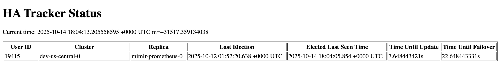
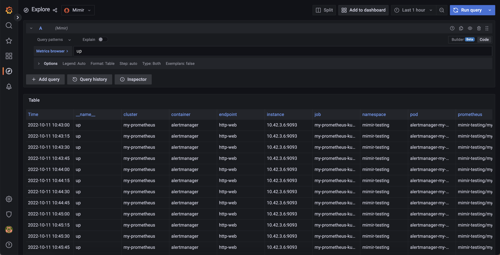

---
aliases:
  - ../configuring/configure-helm-ha-deduplication-consul/
description:
  Learn how to configure the Grafana Mimir Helm chart to handle HA Prometheus
  server deduplication.
menuTitle: Configure high-availability deduplication
title: Configure high-availability deduplication with the Mimir distributed Helm chart
weight: 70
---

# Configure high-availability deduplication with the Mimir distributed Helm chart

Grafana Mimir can deduplicate data from a high-availability (HA) Prometheus setup. Starting from Mimir 3.0, the HA tracker uses `memberlist` by default, which requires no external dependencies. For more information, see [Configure high availability](https://grafana.com/docs/mimir/<MIMIR_VERSION>/configure/configure-high-availability-deduplication/).


Prior to Mimir 3.0, the HA tracker required an external key-value store such as Consul or etcd. These backends are now deprecated. If you're currently using Consul or etcd for the HA tracker, refer to the migration guide.


## Before you begin

You need to have a Grafana Mimir installed via the mimir-distributed Helm chart.

For conceptual information about how Mimir deduplicates incoming HA samples, refer to [Configure high availability](https://grafana.com/docs/mimir/<MIMIR_VERSION>/configure/configure-high-availability-deduplication/).

You also need to configure HA for Prometheus or Grafana Alloy.



## Configure Prometheus or Grafana Alloy to send HA external labels

Configure the Prometheus or Grafana Alloy HA setup by setting the labels named `cluster` and `__replica__`,
which are the default labels for a HA setup in Grafana Mimir. If you want to change the HA labels,
make sure to change them in Mimir as well. This ensures that the configurations of Grafana Mimir, Prometheus, and Grafana Alloy all match each other. Otherwise, HA deduplication will not work.

- The value of the `cluster` label must be same across replicas that belong to the same cluster.
- The value of the `__replica__` label must be unique across replicas within the same cluster.

```yaml
global:
  external_labels:
    __replica__: replica-1
    cluster: my-prometheus
```

Reload or restart Prometheus or Grafana Alloy after you update the configuration.

> **Note:** [Configure high availability](https://grafana.com/docs/mimir/<MIMIR_VERSION>/configure/configure-high-availability-deduplication/) contains the same information on Prometheus setup for HA deduplication.

## Configure Mimir high availability

You can configure Mimir HA deduplication globally or at the tenant level.

### Globally configure HA deduplication

Before you begin, make sure that Mimir was installed using the mimir-distributed Helm chart.

1. Merge the following configuration to your `custom.yaml` file:

```yaml
mimir:
  structuredConfig:
    limits:
      accept_ha_samples: true
      # The following two configurations must match those of external_labels in Prometheus
      # The config values below are the default and can be removed if you don't want to override to a new value
      ha_cluster_label: cluster
      ha_replica_label: __replica__
    distributor:
      ha_tracker:
        enable_ha_tracker: true
        kvstore:
          store: memberlist
```


If memberlist is already configured for other Mimir components (such as the hash ring), the HA tracker will automatically use that configuration. In most Helm deployments, memberlist is already configured, so no additional configuration is needed.


2. Upgrade the Mimir Helm release using the following command:

```bash
 helm -n <mimir-namespace> upgrade mimir grafana/mimir-distributed -f custom.yaml
```

### Configure HA deduplication per tenant

Before you begin, make sure that Mimir was installed using the mimir-distributed Helm chart.

1. Merge the following configuration to the `custom.yaml` file:

```yaml
mimir:
  structuredConfig:
    limits:
      accept_ha_samples: true
      # The following two configurations must match those of external_labels in Prometheus
      # The config values below are the default and can be removed if you don't want to override to a new value
      ha_cluster_label: cluster
      ha_replica_label: __replica__
    distributor:
      ha_tracker:
        enable_ha_tracker: true
        kvstore:
          store: memberlist
runtimeConfig:
  overrides:
    <tenant-id>: # put real tenant ID here
      accept_ha_samples: true
      ha_cluster_label: cluster
      ha_replica_label: __replica__
```

The `mimir` configuration block is similar to the global HA deduplication configuration. The `runtimeConfig` block
configures per-tenant HA deduplication.

2. Upgrade the Mimir's helm release using the following command:

```bash
 helm -n <mimir-namespace> upgrade mimir grafana/mimir-distributed -f custom.yaml
```

## Verifying deduplication

After Prometheus and Mimir are running, you can verify deduplication in several ways.

### ha_tracker's page

Port forward Mimir distributor service. The argument after port-forward must
match your Mimir's distributor name.

```bash
kubectl -n <mimir-namespace> port-forward service/mimir-distributor 8080:8080
```

You can use the following command to get the distributor name:

```bash
kubectl -n <mimir-namespace> get service | grep distributor
```

Open `http://localhost:8080/distributor/ha_tracker` in a browser. You should see the output similar like the following.
If the table is empty, it means there is something wrong with the configuration.



### Distributor metrics

If you have set up [metamonitoring](https://grafana.com/docs/mimir/latest/manage/monitor-grafana-mimir/monitor-system-health/),
Mimir [distributor](https://grafana.com/docs/mimir/<MIMIR_VERSION>/references/architecture/components/distributor/)
exposes some metrics related to HA deduplication. The relevant metrics are those with `cortex_ha_tracker_` prefix.

### Ensure HA metrics are deduplicated

Go to Grafana explore page and select Mimir datasource. Then execute the following query: `up`. In the Options drop down,
select Format = Table. In the result you can see the several time series with different labels.



The most important thing is you will not find `__replica__` label (or any label that you set in `ha_replica_label`
config) anymore. This means you have configured the deduplication successfully.
