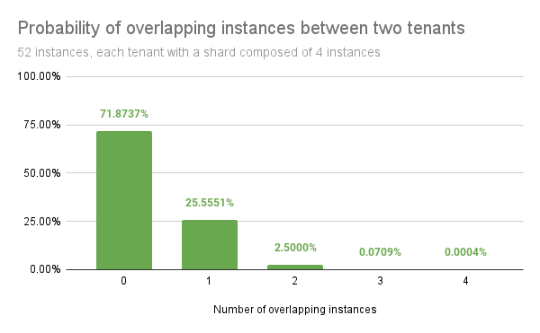

---
aliases:
  - ../configuring/configuring-shuffle-sharding/
  - configuring-shuffle-sharding/
  - ../operators-guide/configure/configure-shuffle-sharding/
description: Learn how to configure shuffle sharding with ingest storage.
menuTitle: Shuffle sharding
title: Configure Grafana Mimir shuffle sharding with ingest storage
weight: 140
---

# Configure Grafana Mimir shuffle sharding with ingest storage

Grafana Mimir leverages sharding to horizontally scale both single- and multi-tenant clusters beyond the capacity of a single node.

## Background

When using ingest storage, Grafana Mimir uses a partition-based sharding strategy that distributes the workload across a subset of partitions.
On the write path, each tenant's series are sharded across a subset of the partitions, and each partition is owned by one or more ingesters for high availability.
The size of this subset, which is the number of partitions, is configured using the `shard size` parameter, which by default is `0`.
This default value means that each tenant uses all available partitions, in order to fairly balance resources such as CPU and memory usage, and to maximize the usage of these resources across the cluster.

In a multi-tenant cluster this default (`0`) value introduces the following downsides:

- An outage affects all tenants.
- A misbehaving tenant, for example, a tenant that causes an out-of-memory error, can negatively affect all other tenants.

Configuring a shard size value higher than `0` enables shuffle sharding. The goal of shuffle sharding is to reduce the blast radius of an outage and better isolate tenants.

## About shuffle sharding

Shuffle sharding is a technique that isolates different tenant's workloads and gives each tenant a single-tenant experience, even if they're running in a shared cluster.
For more information about how AWS describes shuffle sharding, refer to [What is shuffle sharding?](https://aws.amazon.com/builders-library/workload-isolation-using-shuffle-sharding/).

With ingest storage, shuffle sharding assigns each tenant a shard that is composed of a subset of the partitions.
This technique minimizes the number of overlapping partitions between two tenants.
Shuffle sharding provides the following benefits:

- An outage on some partitions or their owner ingesters only affects a subset of tenants.
- A misbehaving tenant only affects the partitions in its shard.
  Assuming that each tenant shard is relatively small compared to the total number of partitions in the cluster, it's likely that any other tenant uses different partitions or that only a subset of partitions match the affected partitions.

Using shuffle sharding doesn't require more resources, but can result in unbalanced load across partitions.

### Low overlapping partitions probability

For example, in a Grafana Mimir cluster that has 50 partitions and assigns each tenant four out of 50 partitions, by shuffling partitions between each tenant, there are 230,000 possible combinations.

Randomly picking two tenants yields the following probabilities:

- 71% chance that they do not share any partition
- 26% chance that they share only 1 partition
- 2.7% chance that they share 2 partitions
- 0.08% chance that they share 3 partitions
- 0.0004% chance that their partitions fully overlap

[//]: # "Diagram source of shuffle-sharding probability at https://docs.google.com/spreadsheets/d/1FXbiWTXi6bdERtamH-IfmpgFq1fNL4GP_KX_yJvbRi4/edit"

## Grafana Mimir shuffle sharding with ingest storage

When using ingest storage, Grafana Mimir supports shuffle sharding in the following components:

- [Partitions (write and read path)](#partitions-shuffle-sharding)
- [Query-frontend / Query-scheduler](#query-frontend-and-query-scheduler-shuffle-sharding)
- [Store-gateway](#store-gateway-shuffle-sharding)
- [Ruler](#ruler-shuffle-sharding)
- [Compactor](#compactor-shuffle-sharding)
- [Alertmanager](#alertmanager-shuffle-sharding)

When you run Grafana Mimir with the default configuration, shuffle sharding is disabled and you need to explicitly enable it by increasing the shard size either globally or for a given tenant.


If the shard size value is equal to or higher than the number of available partitions, for example where `-ingest-storage.ingestion-partition-tenant-shard-size` is higher than the number of active partitions, then shuffle sharding is disabled and all partitions are used again.


### Guaranteed properties

The Grafana Mimir shuffle sharding implementation for partitions provides the following benefits:

- **Stability** 
  Given a consistent state of the partition ring, the shuffle sharding algorithm always selects the same partitions for a given tenant, even across different machines.
- **Consistency** 
  Adding or removing a partition from the ring leads to, at most, only one partition changed in each tenant's shard.
- **Shuffling** 
  Probabilistically and for a large enough cluster, shuffle sharding ensures that every tenant receives a different set of partitions with a reduced number of overlapping partitions between two tenants, which improves failure isolation.

### Partitions shuffle sharding

By default, when using ingest storage, the Grafana Mimir distributor divides the received series among all active partitions.

When you enable partition shuffle sharding, the distributor on the write path divides each tenant's series among `-ingest-storage.ingestion-partition-tenant-shard-size` number of partitions, while on the read path, the querier queries only the ingesters owning partitions that are part of the tenant's shard.

The shard size can be overridden on a per-tenant basis by setting `ingestion_partitions_tenant_shard_size` in the overrides section of the runtime configuration.

#### Partitions write path

To enable shuffle sharding for partitions on the write path, configure the following flag (or its respective YAML configuration option) on the distributor:

- `-ingest-storage.ingestion-partition-tenant-shard-size=<size>` 
  `<size>`: Set the size to the number of partitions each tenant's series should be sharded to. If `<size>` is `0` or is greater than the number of active partitions in the cluster, the tenant's series are sharded across all active partitions.

#### Partitions read path

When shuffle sharding is enabled for the write path, the read path automatically uses the same configuration to query only the relevant partition owners (ingesters). The querier uses the ShuffleShardWithLookback algorithm to:

- Include all partitions in the tenant's current shard
- Include partitions that were recently part of the tenant's shard (within the lookback period)
- Include INACTIVE partitions that are transitioning to a read-only state
- Exclude PENDING partitions that are not yet active

This ensures query consistency during partition lifecycle transitions such as scaling events.

#### Partition states and their impact

Partitions in the ring can have different states that affect shuffle sharding:

- **PENDING**: New partitions being added but not yet active. These are excluded from shuffle sharding.
- **ACTIVE**: Fully operational partitions that receive writes and serve reads.
- **INACTIVE**: Read-only partitions being scaled down. These remain in the shard for querying during the lookback period.

#### Rollout strategy

If you're running a Grafana Mimir cluster with ingest storage and shuffle sharding disabled, you can enable it immediately:

1. Enable shuffle sharding by setting `-ingest-storage.ingestion-partition-tenant-shard-size` to the desired value globally, or configure `ingestion_partitions_tenant_shard_size` in the runtime configuration for specific tenants.
2. The change takes effect immediately for new writes.
3. Queries automatically use ShuffleShardWithLookback to ensure data consistency.

#### Scaling considerations


References to partitions being added or removed correspond to ingesters being scaled out or scaled in. The partition ring manages the logical partitions that map to ingesters, not the underlying Kafka partitions. When scaling out ingesters, ensure the Kafka cluster has the corresponding partition created and ready to receive traffic before starting the new ingester.


**Scaling up partitions:**
- New partitions start in PENDING state and are excluded from shuffle sharding
- Once partitions transition to ACTIVE state, they become eligible for shuffle sharding
- The ShuffleShardWithLookback algorithm ensures queries include both old and new partitions during the transition

**Scaling down partitions:**
- Partitions transition to INACTIVE state and stop receiving new writes
- INACTIVE partitions remain queryable during the lookback period
- After the configured time expires (`-ingester.partition-ring.delete-inactive-partition-after`, default 13 hours), each ingester removes itself and its partition from the ring automatically
- Note: This only removes the logical partition from the ring; the underlying Kafka partitions remain unchanged


Unlike the traditional ingester ring approach, partition shuffle sharding doesn't require zone-awareness since partition ownership is distributed across zones through the ingester instances.


### Query-frontend and query-scheduler shuffle sharding

By default, all Grafana Mimir queriers can execute queries for any tenant.

When you enable shuffle sharding by setting `-query-frontend.max-queriers-per-tenant` (or its respective YAML configuration option) to a value higher than `0` and lower than the number of available queriers, only the specified number of queriers are eligible to execute queries for a given tenant.

Note that this distribution happens in query-frontend, or query-scheduler, if used.
When using query-scheduler, the `-query-frontend.max-queriers-per-tenant` option must be set for the query-scheduler component.
When you don't use query-frontend (with or without query-scheduler), this option is not available.

You can override the maximum number of queriers on a per-tenant basis by setting `max_queriers_per_tenant` in the overrides section of the runtime configuration.

#### The impact of a "query of death"

In the event a tenant sends a "query of death" which causes a querier to crash, the crashed querier becomes disconnected from the query-frontend or query-scheduler, and another running querier is immediately assigned to the tenant's shard.

If the tenant repeatedly sends this query, the new querier assigned to the tenant's shard crashes as well, and yet another querier is assigned to the shard.
This cascading failure can potentially result in all running queriers to crash, one by one, which invalidates the assumption that shuffle sharding contains the blast radius of queries of death.

To mitigate this negative impact, there are experimental configuration options that enable you to configure a time delay between when a querier disconnects due to a crash and when the crashed querier is replaced by a healthy querier.
When you configure a time delay, a tenant that repeatedly sends a "query of death" runs with reduced querier capacity after a querier has crashed.
The tenant could end up having no available queriers, but this configuration reduces the likelihood that the crash impacts other tenants.

A delay of 1 minute might be a reasonable trade-off:

- Query-frontend: `-query-frontend.querier-forget-delay=1m`
- Query-scheduler: `-query-scheduler.querier-forget-delay=1m`

### Store-gateway shuffle sharding

By default, a tenant's blocks are divided among all Grafana Mimir store-gateways.

When you enable store-gateway shuffle sharding by setting `-store-gateway.tenant-shard-size` (or its respective YAML configuration option) to a value higher than `0` and lower than the number of available store-gateways, only the specified number of store-gateways are eligible to load and query blocks for a given tenant.
You must set this flag on the store-gateway, querier, and ruler.

You can override the store-gateway shard size on a per-tenant basis by setting `store_gateway_tenant_shard_size` in the overrides section of the runtime configuration.

For more information about the store-gateway, refer to [store-gateway](/docs/mimir/<MIMIR_VERSION>/references/architecture/components/store-gateway/).

### Ruler shuffle sharding

By default, tenant rule groups are sharded by all Grafana Mimir rulers.

When you enable ruler shuffle sharding by setting `-ruler.tenant-shard-size` (or its respective YAML configuration option) to a value higher than `0` and lower than the number of available rulers, only the specified number of rulers are eligible to evaluate rule groups for a given tenant.

You can override the ruler shard size on a per-tenant basis by setting `ruler_tenant_shard_size` in the overrides section of the runtime configuration.

### Compactor shuffle sharding

By default, tenant blocks can be compacted by any Grafana Mimir compactor.

When you enable compactor shuffle sharding by setting `-compactor.compactor-tenant-shard-size` (or its respective YAML configuration option) to a value higher than `0` and lower than the number of available compactors, only the specified number of compactors are eligible to compact blocks for a given tenant.

You can override the compactor shard size on a per-tenant basis setting by `compactor_tenant_shard_size` in the overrides section of the runtime configuration.

### Alertmanager shuffle sharding

Alertmanager only performs distribution across replicas per tenant. The state and workload is not divided any further. The replication factor setting `-alertmanager.sharding-ring.replication-factor` determines how many replicas are used for a tenant.

As a result, shuffle sharding is effectively always enabled for Alertmanager.

### Shuffle sharding impact to the KV store

Shuffle sharding does not add additional overhead to the KV store.
Shards are computed client-side and are not stored in the ring.
KV store sizing depends primarily on the number of replicas of any component that uses the ring, for example, ingesters, and the number of tokens per replica.

However, in some components, each tenant's shard is cached in-memory on the client-side, which might slightly increase their memory footprint. Increased memory footprint can happen mostly in the distributor.