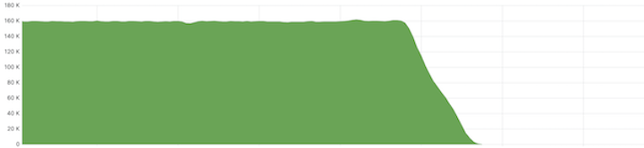
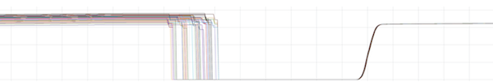

---
aliases:
  - ../operators-guide/configure/configure-spread-minimizing-tokens/
description: Learn how to migrate ingesters to spread-minimizing tokens.
weight: 115
menuTitle: Spread-minimizing tokens
title: Migrate ingesters to spread-minimizing tokens
---

# Migrate ingesters to spread-minimizing tokens

Using this guide, you can configure Mimir's ingesters to use the _spread-minimizing token generation strategy_.

## Before you begin

The ingester time series replication should be [configured with enabled zone-awareness](https://grafana.com/docs/mimir/latest/configure/configure-zone-aware-replication/#configuring-ingester-time-series-replication).

{}Spread-mimizing tokens are recommended if [shuffle-sharding](https://grafana.com/docs/mimir/latest/configure/configure-shuffle-sharding/#ingesters-shuffle-sharding) is disabled on the [write path](https://grafana.com/docs/mimir/latest/configure/configure-shuffle-sharding/#ingesters-write-path) of your ingesters, or, if it is enabled, but most of the tenants of your system use all available ingesters.
{}

{}In order to prevent incorrect query results, [shuffle-sharding](https://grafana.com/docs/mimir/latest/configure/configure-shuffle-sharding/#ingesters-shuffle-sharding) on the [read path](https://grafana.com/docs/mimir/latest/configure/configure-shuffle-sharding/#ingesters-read-path) of your ingesters must be disabled before migrating ingesters to the spread-minimizing tokens. Shuffle-sharding on ingester's read path can be re-enabled at least `-querier.query-store-after` time after the last ingester zone was migrated to the spread-minimizing tokens.
{}

If ingesters are configured with a non-empty value of `-ingester.ring.tokens-file-path`, this is the file where ingesters store the tokens at shutdown and restore them at startup. Keep track of this value, because you need it in the last step.

For simplicity, let’s assume that there are three configured availability zones named `zone-a`, `zone-b`, and `zone-c`. Migration to the _spread-minimizing token generation strategy_ is a complex process performed zone by zone to prevent any data loss.

## Step 1: Disable write requests to ingesters from `zone-a`

To disable write requests, configure the following flag on the distributor and the ruler:

```
-ingester.ring.excluded-zones=zone-a
```

Before proceeding to the next step, use the following query to ensure that there are no write requests to the ingesters from `zone-a`:

```
sum by(route) (
  rate(
    cortex_request_duration_seconds_count{
      namespace="<your-namespace>",
      container="ingester",
      pod=~"ingester-zone-a-.*",
      route="/cortex.Ingester/Push"}[5m]
  )
)
```

You should see something like this:



## Step 2: Shut down ingesters from `zone-a`

Call the [/ingester/shutdown](https://github.com/grafana/mimir/blob/main/docs/sources/mimir/references/http-api/index.md#shutdown) endpoint on all ingesters from `zone-a` to flush all in-memory series and metrics to long-term storage and to clear all ingesters from the ring.

Before proceeding to the next step, ensure that all calls complete successfully.

## Step 3: Enable spread-minimizing tokens for ingesters in `zone-a`

Configure the following flags on the ingesters from `zone-a`:

```
-ingester.ring.tokens-file-path=
-ingester.ring.token-generation-strategy=spread-minimizing
-ingester.ring.spread-minimizing-zones=zone-a,zone-b,zone-c
```

{}
The example uses `zone-a,zone-b,zone-c` to denote a comma-separated list of configured availability zones.
{}

Before proceeding to the next step, ensure that all the ingester pods related to `zone-a` are up and running with the new configuration.

### Optional step: In-order registration of ingesters

Mimir can force the ring to perform an in-order registration of ingesters. When this feature is enabled, an ingester can register its tokens within the ring only after all previous ingesters (with ID lower than its own ID) have already been registered.
This feature minimizes a probability that a write request that should be handled by an ingester actually arrives to the ring before the ingester is registered within the ring. In this case, the request gets handled by another ingester.
This situation could introduce some deviation from an optimal load distribution.

To configure this capability:

```
-ingester.ring.spread-minimizing-join-ring-in-order=true
```

## Step 4: Re-enable write requests to ingesters from `zone-a`

To re-enable write requests, revert [link Step 1: Disable write requests to ingesters from `zone-a`](#step-1-disable-write-requests-to-ingesters-from-zone-a).

At this point, you can check the number of in-memory time series of ingesters from `zone-a` using the following query:

```
sum by(pod) (
  cortex_ingester_memory_series{
    namespace="<your-namespace>",
    pod=~"ingester-zone-a-.*"}
)
```

If everything went smoothly, you should see something like this:



## Step 5: Migrate ingesters from `zone-b`

Repeat steps 1 to 4, replacing all the occurrences of `zone-a` with `zone-b`.

## Step 6: Migrate ingesters from `zone-c`

Repeat steps 1 to 4, replacing all the occurrences of `zone-a` with `zone-c`.

## Step 7: Delete the old token files

If, before the migration, you configured ingesters to store their tokens under `-ingester.ring.tokens-file-path`, you must delete these files after migrating all ingester zones to spread-minimizing tokens.

For example, if an ingester pod called `ingester-zone-a` from a namespace called `mimir-prod` used to store its tokens in a file called `/data/tokens`, you can run the following command to delete the `/data/tokens` file:

```
kubectl -n mimir-prod exec ingester-zone-a-0 -- rm /data/tokens
```
