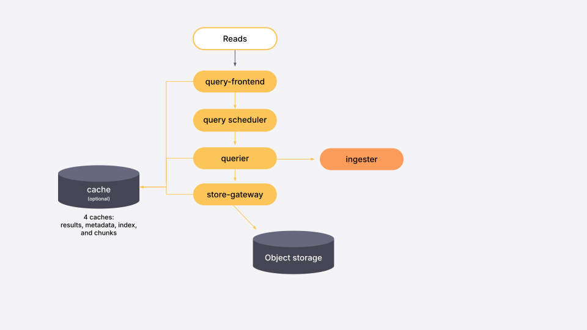

# About classic architecture

Classic architecture uses stateful ingesters with local write-ahead logs to manage both the ingestion of new data and serving recent data for queries.


Classic architecture is still supported in Grafana Mimir version 3.0. However, this architecture is set to be deprecated in a future release. As a best practice, use ingest storage architecture when setting up a new Grafana Mimir deployment. Refer to [About ingest storage architecture](../about-ingest-storage-architecture/).


## Grafana Mimir components in classic architecture

Most components are stateless and do not require any data persisted between process restarts. Some components are stateful and rely on non-volatile storage to prevent data loss between process restarts. For details about each component, see its page in [Components](../../../references/architecture/components/).

### The write path

[//]: # "Diagram source of write path at https://docs.google.com/presentation/d/1LemaTVqa4Lf_tpql060vVoDGXrthp-Pie_SQL7qwHjc/edit#slide=id.g11658e7e4c6_0_899"

Ingesters receive incoming samples from the distributors.
Each push request belongs to a tenant, and the ingester appends the received samples to the specific per-tenant TSDB that is stored on the local disk.
The samples that are received are both kept in-memory and written to a write-ahead log (WAL).
If the ingester abruptly terminates, the WAL can help to recover the in-memory series.
The per-tenant TSDB is lazily created in each ingester as soon as the first samples are received for that tenant.

The in-memory samples are periodically flushed to disk, and the WAL is truncated, when a new TSDB block is created.
By default, this occurs every two hours.
Each newly created block is uploaded to long-term storage but kept in the ingester until the configured `-blocks-storage.tsdb.retention-period` expires.
This gives [queriers](../../../references/architecture/components/querier/) and [store-gateways](../../../references/architecture/components/store-gateway/) enough time to discover the new block on the storage and download its index-header.

To effectively use the WAL, and to be able to recover the in-memory series if an ingester abruptly terminates, store the WAL to a persistent disk that can survive an ingester failure.
For example, when running in a cloud environment, attach an AWS EBS volume, a GCP Persistent Disk, or something similar to the VM instance.
If you are running the Grafana Mimir cluster in Kubernetes, you can use a StatefulSet with a persistent volume claim for the ingesters.
The location on the filesystem where the WAL is stored is the same location where local TSDB blocks (compacted from head) are stored. The locations of the WAL and the local TSDB blocks cannot be decoupled.

For more information, refer to [timeline of block uploads](../../../manage/run-production-environment/production-tips/#how-to-estimate--querierquery-store-after) and [Ingester](../../../references/architecture/components/ingester/).

#### Series sharding and replication

By default, each time series is replicated to three ingesters, and each ingester writes its own block to the long-term storage.
The [Compactor](../../../references/architecture/components/compactor/) merges blocks from multiple ingesters into a single block, and removes duplicate samples.
Blocks compaction significantly reduces storage utilization.
For more information, refer to [Compactor](../../../references/architecture/components/compactor/) and [Production tips](../../../manage/run-production-environment/production-tips/).

### The read path

[//]: # "Diagram source of read path at https://docs.google.com/presentation/d/1LemaTVqa4Lf_tpql060vVoDGXrthp-Pie_SQL7qwHjc/edit#slide=id.g11658e7e4c6_2_6"

Queries coming into Grafana Mimir arrive at the [query-frontend](../../../references/architecture/components/query-frontend/). The query-frontend then splits queries over longer time ranges into multiple, smaller queries.

The query-frontend next checks the results cache. If the result of a query has been cached, the query-frontend returns the cached results. Queries that cannot be answered from the results cache are put into an in-memory queue within the query-frontend.


If you run the optional [query-scheduler](../../../references/architecture/components/query-scheduler/) component, the query-schedule maintains the queue instead of the query-frontend.


The queriers act as workers, pulling queries from the queue.

The queriers connect to the store-gateways and the ingesters to fetch all the data needed to execute a query. For more information about how the query is executed, refer to [querier](../../../references/architecture/components/querier/).

After the querier executes the query, it returns the results to the query-frontend for aggregation. The query-frontend then returns the aggregated results to the client.
