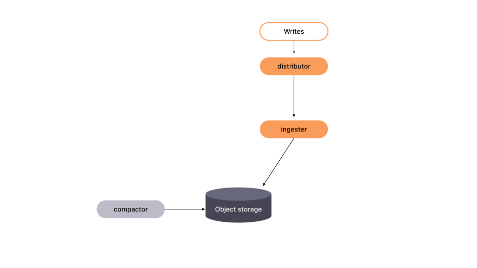

---
aliases:
  - ../operators-guide/architecture/about-grafana-mimir-architecture/
description: Learn about the Grafana Mimir architecture.
menuTitle: Grafana Mimir architecture
title: Grafana Mimir architecture
weight: 5
---

<!-- Note: This topic is mounted in the GEM documentation. Ensure that all updates are also applicable to GEM. -->

# Grafana Mimir architecture

Grafana Mimir has a microservices-based architecture. The system has multiple horizontally scalable microservices that can run separately and in parallel. Grafana Mimir microservices are called components.

Grafana Mimir's design compiles the code for all components into a single binary. The `-target` parameter controls which components that single binary behaves as.

To get started, you can run Grafana Mimir in [monolithic mode](../../references/architecture/deployment-modes/#monolithic-mode) with all components running simultaneously in one process. For more information, refer to [Deployment modes](../../references/architecture/deployment-modes/).

Starting with version 3.0, you can deploy Grafana Mimir using the following architectures:

- Ingest storage (default): This architecture uses Kafka as a central pipeline to decouple read and write operations. Refer to [About ingest storage architecture](about-ingest-storage-architecture/).
- Classic: This architecture uses stateful ingesters with local write-ahead logs to manage both the ingestion of new data and serving recent data for queries. Refer to [About classic architecture](about-classic-architecture/).


Classic architecture is still supported in Grafana Mimir version 3.0. However, this architecture is set to be deprecated in a future release. As a best practice, use ingest storage architecture when setting up a new Grafana Mimir deployment.

## Grafana Mimir components

Most components are stateless and do not require any data persisted between process restarts. Some components are stateful and rely on non-volatile storage to prevent data loss between process restarts. For details about each component, see its page in [Components](../../references/architecture/components/).

### The write path

[//]: # "Diagram source of write path at https://docs.google.com/presentation/d/1LemaTVqa4Lf_tpql060vVoDGXrthp-Pie_SQL7qwHjc/edit#slide=id.g11658e7e4c6_0_899"

Distributors receive incoming samples in the form of push requests.
Each push request belongs to a tenant. Distributors shard incoming push requests to multiple Kafka partitions of the same Kafka topic.
Push requests receive a successful response after the distributor has received an acknowledgement from the Kafka brokers
that all Kafka records have been successfully replicated and durably persisted.

Because of this we consider that ingest storage architecture's write path ends in Kafka.
This is unlike the classic architecture whose write path includes ingesters and requires a quorum of ingesters to be available for push requests to succeed.

#### Series sharding and replication

By default, each time series from a push request is indepndantly sharded to a single Kafka partition. As a result the timeseries from the push request can fall into multiple partitions.
Replication on the write path is delegated to the Kafka cluster.
Ingesters consume from partitions and each ingester writes its own block to the long-term storage.
The [Compactor](../../references/architecture/components/compactor/) merges blocks from multiple ingesters into a single block, and removes duplicate samples.
Blocks compaction significantly reduces storage utilization.
For more information, refer to [Compactor](../../references/architecture/components/compactor/) and [Production tips](../../manage/run-production-environment/production-tips/).

### The read path

<!-- we need a new diagram. Can we reuse Marco's powerpoints? -->

[//]: # "Diagram source of read path at https://docs.google.com/presentation/d/1LemaTVqa4Lf_tpql060vVoDGXrthp-Pie_SQL7qwHjc/edit#slide=id.g11658e7e4c6_2_6"

#### Communicating between the read and the write path

Samples written by distributors to Kafka on the write path are consumed by ingesters on the read path.
Each partition is assigned to a single ingester from each zone and each ingester consumes from exactly one partition.
High availability on the read path is achieved through multiple ingester zones.

Ingesters choose what partition to consume from based on the suffix of their hostname.
For example if the hostname of the ingester is `ingester-zone-a-13`, the this ingester will consume from partition 13.
Each ingester persist the partition offset up to which it has consumed records in a Kafka consumer group that it doesn't share with other ingesters.

Ingesters continuously consume samples from Kafka and append them to the specific per-tenant timeseries database (TSDB) that is stored on the local disk.
The per-tenant TSDB in the ingester is lazily created in each ingester as soon as the first samples are received for that tenant.
The samples that are received are both kept in-memory and written to a write-ahead log (WAL).
If the ingester abruptly terminates, the WAL can help to recover the in-memory series.
After the ingester recovers from the downtime and has replayed the local WAL,
it resumes consuming from Kafka from the offset stored in its consumer group.
Using this technique the ingester never misses a sample written to Kafka and observes samples in the same order as other ingesters consuming the same partition.

The in-memory samples are periodically flushed to disk, and the WAL is truncated, when a new TSDB block is created.
By default, this occurs every two hours.
Each newly created block is uploaded to long-term storage and kept in the ingester until the configured `-blocks-storage.tsdb.retention-period` expires.
This gives [queriers](../../references/architecture/components/querier/) and [store-gateways](../../references/architecture/components/store-gateway/) enough time to discover the new block on the storage and download its index-header.

To effectively use the WAL, and to be able to recover the in-memory series if an ingester abruptly terminates, store the WAL to a persistent disk that can survive an ingester failure.
For example, when running in the cloud, include an AWS EBS volume or a GCP Persistent Disk.
If you are running the Grafana Mimir cluster in Kubernetes, you can use a StatefulSet with a persistent volume claim for the ingesters.
The location on the filesystem where the WAL is stored is the same location where local TSDB blocks (compacted from head) are stored. The locations of the WAL and the local TSDB blocks cannot be decoupled.

Optionally, in the ingest storage architecture the block-builder can take the responsibility of building TSDB blocks from
records in Kafka and uploads them to long-term storage.
<!-- dimitarvdimitrov: I'm not sure we should mention the block-builder since it's still a component in development and not stable and ready for production use. After reading this a secondt ime, i'm tempted to not include docs about the block builder now -->

For more information, refer to [timeline of block uploads](../../manage/run-production-environment/production-tips/#how-to-estimate--querierquery-store-after) and [Ingester](../../references/architecture/components/ingester/).

#### The lifecycle of a query

Queries coming into Grafana Mimir arrive at the [query-frontend](../../references/architecture/components/query-frontend/). The query-frontend then splits queries over longer time ranges into multiple, smaller queries.

The query-frontend next checks the results cache. If the result of a query has been cached, the query-frontend returns the cached results. Queries that cannot be answered from the results cache are put into an in-memory queue within the query-frontend.

For queries requiring strong read consistency (with the `X-Read-Consistency: strong` HTTP header) the query-frontend retrieves the offsets of each partition from the Kafka topic and propagates it through the read path to ignesters. For more information refer to [Data freshness on the read path](#data-freshness-on-the-read-path) mentioned later.


If you run the optional [query-scheduler](../../references/architecture/components/query-scheduler/) component, the query-schedule maintains the queue instead of the query-frontend.


The queriers act as workers, pulling queries from the queue.

The queriers connect to the store-gateways and the ingesters to fetch all the data needed to execute a query. For more information about how the query is executed, refer to [querier](../../references/architecture/components/querier/).

After the querier executes the query, it returns the results to the query-frontend for aggregation. The query-frontend then returns the aggregated results to the client.

#### Data freshness on the read path

Ingesters consume from Kafka asynchronously of serving queries. By default ingesters do not take any explicit action to make sure that any samples written to Kafka have been appended to the in-memory TSDB and on-disk WAL before a query is received. This allows ingesters to whitstand Kafka outages without rejeceting queries. The impact of Kafka outages is that
queries that ingesters serve may return stale data and not provide a read-after-write guarantee.

During normal operations the delay in ingesting data in ingesters should be below 1 second. This is also know as the end-to-end latency of ingestion.

While the end-to-end latency is usually insignificant for interactive queries, it may poses a challenge for applications that need a guarantee that queries observe all previous writes.
One such application is the Mimir [ruler](../../references/architecture/components/ruler) when it evaluates a rule group. The ruler needs samples of earlier rules in the same rule group to be available
when evaluating later rules in the rule group.

In order to preserve the read-after-write guarantee, clients can add the `X-Read-Consistency: strong` HTTP header to queries.
When a query includes this header, the query-frontend fetches the latest offsets from Kafka for all in-use partitions and propagates these offsets to ingesters. Each ingester then waits until it has consumed up to the specified offset for its partition before executing the query. This ensures that the query observes all samples that were written to Kafka before the query was received by the query-frontend, providing strong read consistency at the cost of increased query latency.

By default the ingester waits up to 20 seconds for the record to be consumed before rejecting the strong read consistency query. This is configurable via `-ingest-storage.kafka.wait-strong-read-consistency-timeout` (TODO dimitarvdimitrov: do we want to mention the flag here? it sounds like it's too much details for an architecture overview).

## The role of Prometheus

Prometheus instances scrape samples from various targets and push them to Grafana Mimir by using Prometheus’ [remote write API](https://prometheus.io/docs/prometheus/latest/storage/#remote-storage-integrations).
The remote write API emits batched [Snappy](https://google.github.io/snappy/)-compressed [Protocol Buffer](https://protobuf.dev/) messages inside the body of an HTTP `PUT` request.

Grafana Mimir requires that each HTTP request has a header that specifies a tenant ID for the request. Request [authentication and authorization](../../manage/secure/authentication-and-authorization/) are handled by an external reverse proxy.

Incoming samples (writes from Prometheus) are handled by the [distributor](../../references/architecture/components/distributor/), and incoming reads (PromQL queries) are handled by the [query frontend](../../references/architecture/components/query-frontend/).

## Long-term storage

The Grafana Mimir storage format is based on [Prometheus TSDB storage](https://prometheus.io/docs/prometheus/latest/storage/).
The Grafana Mimir storage format stores each tenant's time series into their own TSDB, which persists series to an on-disk block.
By default, each block has a two-hour range.
Each on-disk block directory contains an index file, a file containing metadata, and the time series chunks.

The TSDB block files contain samples for multiple series.
The series inside the blocks are indexed by a per-block index, which indexes both metric names and labels to time series in the block files.
Each series has its samples organized in chunks, which represent a specific time range of stored samples.
Chunks may vary in length depending on specific configuration options and ingestion rate, usually storing around 120 samples per chunk.

Grafana Mimir requires any of the following object stores for the block files:

- [Amazon S3](https://aws.amazon.com/s3)
- [Google Cloud Storage](https://cloud.google.com/storage/)
- [Microsoft Azure Storage](https://azure.microsoft.com/en-us/services/storage/)
- [OpenStack Swift](https://wiki.openstack.org/wiki/Swift)
- Local Filesystem (single node only)

For more information, refer to [configure object storage](../../configure/configure-object-storage-backend/) and [configure metrics storage retention](../../configure/configure-metrics-storage-retention/).

## Kafka

Kafka is a central part of the ingest storage architecture. It is responsible for replicating and durably persisting incoming data
and for making this data available to ingesters.

Mimir's usage of the Kafka protocol is limited, which allows to use many Kafka-compatible solutions.

### How Mimir uses Kafka
<!-- TODO dimitarvdimitrov: here' i'm not sure about the best way to structure this content. Would a table be better? -->

On the write path the distributor rquires the Kafka cluster to be available for push requests to succeed.
The distributor issues direct **Produce API** calls to the Kafka brokers and does not produce in **transactions** and does not need support for **idempotent writes**.

Both the ingester and the distributor use the **Metadata API** to discover the leaders for a topic-partition.

The Mimir ingester uses Kafka **consumer groups** to persist how far an ingester has consumed from its assigned partition. Each ingester maintains its own consumer group. Each Kafka record is consumed exactly once by each ingester zone and records are not replayed after being consumed. There are two exxceptions to this: 

1. When an ingester is abruptly terminated and has not had the chance to persist its offset in the consumer group. In that case the ingester will pick back up where the consumer group offset points to.
2. Ingesters can optionally be configured to start consuming from the earliest offset, the latest offset, or a specific timestamp of the Kafka topic-partition. In those cases the ingester will use the **ListOffsets API** to discover the target offset.

Ingesters do not need Kafka to be available to serve queries. During a Kafka outage, ingesters can continue serving queries with the data they have already consumed from Kafka and stored in memory or on disk.

Kafka retention should be configured based on how long of an ingester outage the operator wants to be able to withstand without data loss. If ingesters are unavailable for longer than the Kafka retention period, they will not be able to resume from the offset in their consumer group, leading to a gap in ingested samples.
