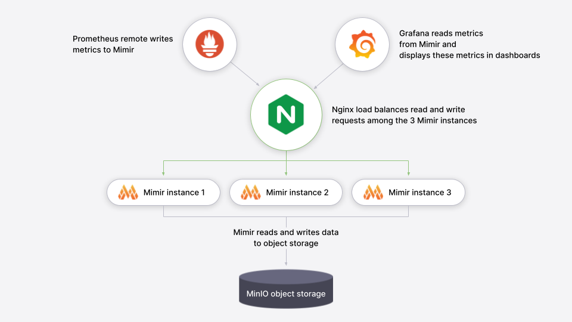

---
aliases:
  - /tutorials/play-with-grafana-mimir/
  - ../tutorials/play-with-grafana-mimir/
associated_technologies:
  - mimir
author:
  - marco
canonical: https://grafana.com/tutorials/play-with-grafana-mimir/
description: Learn about Grafana Mimir, which provides distributed,
  horizontally scalable, and highly available long term storage for Prometheus.
keywords:
  - mimir tutorial
  - learn mimir
  - mimir overview
  - what is mimir
  - time series database
  - TSDB
  - Prometheus storage
  - metrics storage
  - metrics datastore
  - observability
  - Prometheus read write
menuTitle: Play with Mimir
title: Play with Mimir
weight: 10
killercoda:
  title: Play with Mimir
  description: Learn about Grafana Mimir, which provides distributed, horizontally scalable, and highly available long term storage for Prometheus.
  details:
    intro:
      foreground: "docker-compose-update.sh"
  preprocessing:
    substitutions:
      - regexp: "tutorial-architecture\\.png"
        replacement: https://grafana.com/media/docs/mimir/tutorial-architecture.png
  backend:
    imageid: ubuntu
---

<!-- INTERACTIVE page intro.md START -->

# Play with Mimir

Grafana Mimir is a distributed, horizontally scalable, and highly available long term storage for [Prometheus](https://prometheus.io).

In this tutorial, you'll:

- Run Grafana Mimir locally with Docker Compose
- Run Prometheus to scrape some metrics and remote write to Grafana Mimir
- Run Grafana to explore Grafana Mimir dashboards
- Configure a testing recording rule and alert in Grafana Mimir

<!-- INTERACTIVE ignore START -->

## Prerequisites

- Git
- [Docker](https://docs.docker.com/) and [Docker Compose](https://docs.docker.com/compose/)
- Availability of both ports `9000` and `9009` on your host machine


Alternatively, you can try out this example in our interactive learning environment: [Play with Mimir](https://killercoda.com/grafana-labs/course/mimir/play-with-mimir).

It's a fully configured environment with all dependencies already installed.



<!-- INTERACTIVE ignore END -->

<!-- INTERACTIVE page intro.md END -->

<!-- INTERACTIVE page step1.md START -->

## Download tutorial configuration

1. Create a copy of the Grafana Mimir repository using the Git command line:
   ```bash
   git clone https://github.com/grafana/mimir.git
   cd mimir
   ```
1. Navigate to the tutorial directory:
   ```bash
   cd docs/sources/mimir/get-started/play-with-grafana-mimir/
   ```


The instructions in this tutorial assume that your working directory is `docs/sources/mimir/get-started/play-with-grafana-mimir/`.


<!-- INTERACTIVE page step1.md END -->

<!-- INTERACTIVE page step2.md START -->

## Start Grafana Mimir and dependencies

Start running your local setup with the following Docker command:

```bash
docker compose up -d
```

This command starts:

- Grafana Mimir
  - Three instances of monolithic-mode Mimir to provide high availability
  - Multi-tenancy enabled (tenant ID is `demo`)
- [Minio](https://min.io/)
  - S3-compatible persistent storage for blocks, rules, and alerts
- Prometheus
  - Scrapes Grafana Mimir metrics, then writes them back to Grafana Mimir to ensure availability of ingested metrics
- Grafana
  - Includes a preinstalled datasource to query Grafana Mimir
  - Includes preinstalled dashboards for monitoring Grafana Mimir
- Load balancer
  - A simple NGINX-based load balancer that exposes Grafana Mimir endpoints on the host

The diagram below illustrates the relationship between these components:


The following ports will be exposed on the host:

- Grafana on [`http://localhost:9000`](http://localhost:9000)
- Grafana Mimir on [`http://localhost:9009`](http://localhost:9009)

To learn more about the Grafana Mimir configuration, you can review the configuration file `config/mimir.yaml`.

<!-- INTERACTIVE page step2.md END -->

<!-- INTERACTIVE page step3.md START -->

## Explore Grafana Mimir dashboards



Sandbox users: If you're using the interactive learning environment, you can access all links directly by clicking on them. This will redirect you to the VM's localhost where the services are running.



Open Grafana on your local host [`http://localhost:9000`](http://localhost:9000) and view dashboards showing the status
and health of your Grafana Mimir cluster. The dashboards query Grafana Mimir for the metrics they display.

To start, we recommend looking at these dashboards:

- [Writes](http://localhost:9000/d/8280707b8f16e7b87b840fc1cc92d4c5/mimir-writes)
- [Reads](http://localhost:9000/d/e327503188913dc38ad571c647eef643/mimir-reads)
- [Queries](http://localhost:9000/d/b3abe8d5c040395cc36615cb4334c92d/mimir-queries)
- [Object Store](http://localhost:9000/d/e1324ee2a434f4158c00a9ee279d3292/mimir-object-store)

A couple of caveats:

- It typically takes a few minutes after Grafana Mimir starts to display meaningful metrics in the dashboards.
- Because this tutorial runs Grafana Mimir without any query-scheduler, or memcached, the related panels are expected to be empty.

The dashboards installed in the Grafana are taken from the Grafana Mimir mixin which packages up Grafana Labs' best practice dashboards, recording rules, and alerts for monitoring Grafana Mimir. To learn more about the mixin, check out the Grafana Mimir mixin documentation. To learn more about how Grafana is connecting to Grafana Mimir, review the [Mimir datasource](http://localhost:9000/datasources).

<!-- INTERACTIVE page step3.md END -->

<!-- INTERACTIVE page step4.md START -->

## Configure your first recording rule

Recording rules allow you to precompute frequently needed or computationally expensive expressions and save their result
as a new set of time series. In this section you're going to configure a recording rule in Grafana Mimir using tooling
offered by Grafana.

1. Open [Grafana Alerting](http://localhost:9000/alerting/list).
2. Click **New recording rule**, which also allows you to configure recording rules.
3. Configure the recording rule:
   1. Give the rule a name, such as `sum:up`.
   1. Choose **Mimir** in the **Select data source** field.
   1. Choose **Code** in the **Builder | Code** field on the right.
   1. Type `sum(up)` in the **Metrics browser** query field.
   1. Type `example-namespace` in the **Namespace** field.
   1. Type `example-group` in the **Group** field.
   1. From the upper-right corner, click the **Save and exit** button.

Your `sum:up` recording rule will show the number of Mimir instances that are `up`, meaning reachable to be scraped. The
rule is now being created in Grafana Mimir ruler and will be soon available for querying:

1. Open [Grafana Explore](http://localhost:9000/explore?orgId=1&left=%7B%22datasource%22:%22Mimir%22,%22queries%22:%5B%7B%22refId%22:%22A%22,%22instant%22:true,%22range%22:true,%22exemplar%22:true,%22expr%22:%22sum:up%22%7D%5D,%22range%22:%7B%22from%22:%22now-1h%22,%22to%22:%22now%22%7D%7D)
   and query the resulting series from the recording rule, which may require up to one minute to display after configuration:
   ```
   sum:up
   ```
1. Confirm the query returns a value of `3` which is the number of Mimir instances currently running in your local setup.

<!-- INTERACTIVE page step4.md END -->

<!-- INTERACTIVE page step5.md START -->

## Configure your first alert rule

Alerting rules allow you to define alert conditions based on PromQL expressions and to send notifications about firing
alerts to Grafana Mimir Alertmanager. In this section you're going to configure an alerting rule in Grafana Mimir using
tooling offered by Grafana.

1. Open [Grafana Alerting](http://localhost:9000/alerting/list).
1. Click **New alert rule**.
1. Configure the alert rule:
   1. Type `MimirNotRunning` in the **Rule name** field.
   1. Choose **Mimir** in the **Select data source** field.
   1. Type `count(up == 0)` in the **Metrics browser** query field. This currently shows `no data` since all instances are running.
1. Scroll down to **Set evaluation behavior**:
   1. Select `New folder` and type `example-folder` in the **Folder name** field.
   1. Select `New evaluation group` and type `example-group` in the **Group name** field. Set the evaluation interval to `30s`.
1. Scroll down to **Configure labels and notifications**:
   1. Select the `Contract point` dropdown and choose `grafana-default-email`.
1. Click the **Save rule and exit** button.

Your `MimirNotRunning` alert rule is now being created in Grafana Mimir ruler and is expected to fire when the number of
Grafana Mimir instances is less than three. You can check its status by opening the [Grafana Alerting](http://localhost:9000/alerting/list)
page and expanding the "example-namespace > example-group" row. The status should be "Normal" since all three instances are currently running.

To see the alert firing we can introduce an outage in the Grafana Mimir cluster:

1. Abruptly terminate one of the three Grafana Mimir instances:
   ```bash
   docker compose kill mimir-3
   ```
2. Open [Grafana Alerting](http://localhost:9000/alerting/list) and check out the state of the alert `MimirNotRunning`,
   which should switch to "Pending" state in about one minute and to "Firing" state after another minute. _Note: since we abruptly
   terminated a Mimir instance, Grafana Alerting UI may temporarily show an error when querying rules: the error will
   auto resolve shortly, as soon as Grafana Mimir internal health checking detects the terminated instance as unhealthy._

Grafana Mimir Alertmanager has not been configured yet to notify alerts through a notification channel. To configure the
Alertmanager you can open the [Contact points](http://localhost:9000/alerting/notifications) page in Grafana and
set your preferred notification channel. Note the email receiver doesn't work in this example because there's no
SMTP server running.

Before adding back our terminated Mimir instance to resolve the alert, go into the Grafana Explore page and query your `sum:up`
recording rule. You should see that value of `sum:up` should have dropped to `2`, now that one instance is down. You'll also notice
that querying for this rule and all other metrics continues to work even though one instance is down. This demonstrates that highly
available Grafana Mimir setups like the three instance deployment in this demo are resilient to outages of individual nodes.

To resolve the alert and recover from the outage, restart the Grafana Mimir instance that was abruptly terminated:

1. Start the Grafana Mimir instances:
   ```bash
   docker-compose start mimir-3
   ```
2. Open [Grafana Alerting](http://localhost:9000/alerting/list) and check out the state of the alert `MimirNotRunning`,
   which should switch to "Normal" state in about 30 seconds.

<!-- INTERACTIVE page step5.md END -->

<!-- INTERACTIVE page finish.md START -->

## Summary

In this tutorial you started Grafana Mimir locally in a high-available setup as well as a Prometheus instance that remote wrote
some metrics to Grafana Mimir. You then queried those metrics stored in Mimir using Grafana, and visualized them in some Grafana dashboards.
Lastly, you configured a recording rule and an alert via the Grafana Alerting UI and verified that the alert fired as expected when the condition was met.

<!-- INTERACTIVE ignore START -->

Once you've completed the tutorial, release all Docker resources by running this Docker command:

```bash
docker-compose down -v
```

<!-- INTERACTIVE ignore END -->

<!-- INTERACTIVE page finish.md END -->
