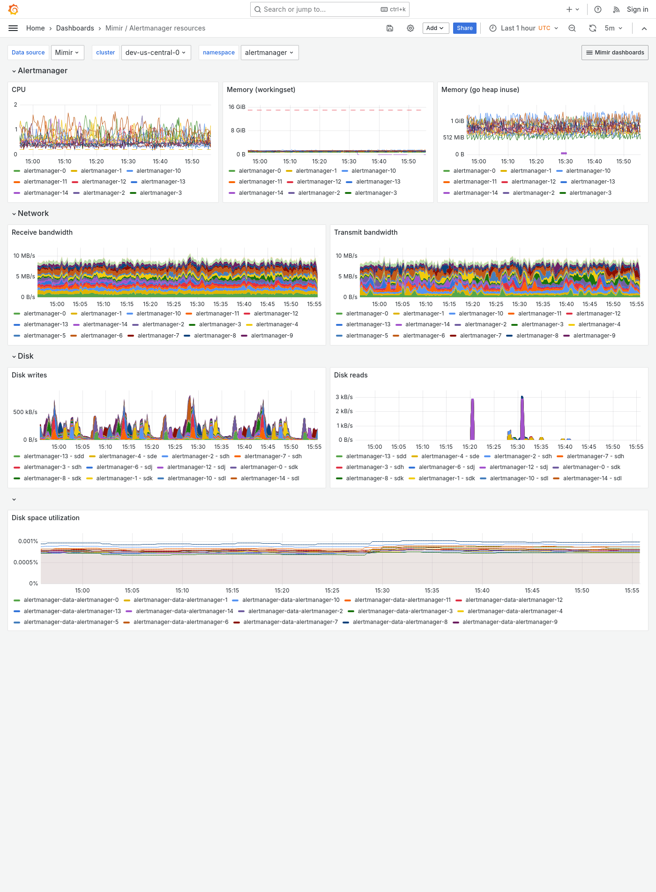

---
aliases:
  - ../../../operators-guide/monitor-grafana-mimir/dashboards/alertmanager-resources/
  - ../../monitoring-grafana-mimir/dashboards/alertmanager-resources/
  - ../../visualizing-metrics/dashboards/alertmanager-resources/
description: View an example Alertmanager resources dashboard.
menuTitle: Alertmanager resources
title: Grafana Mimir Alertmanager resources dashboard
weight: 20
---

# Grafana Mimir Alertmanager resources dashboard

The Alertmanager resources dashboard shows CPU, memory, disk and networking metrics for the Alertmanager.

This dashboard requires [additional resources metrics]().

## Example

The following example shows an Alertmanager resources dashboard from a demo cluster.

