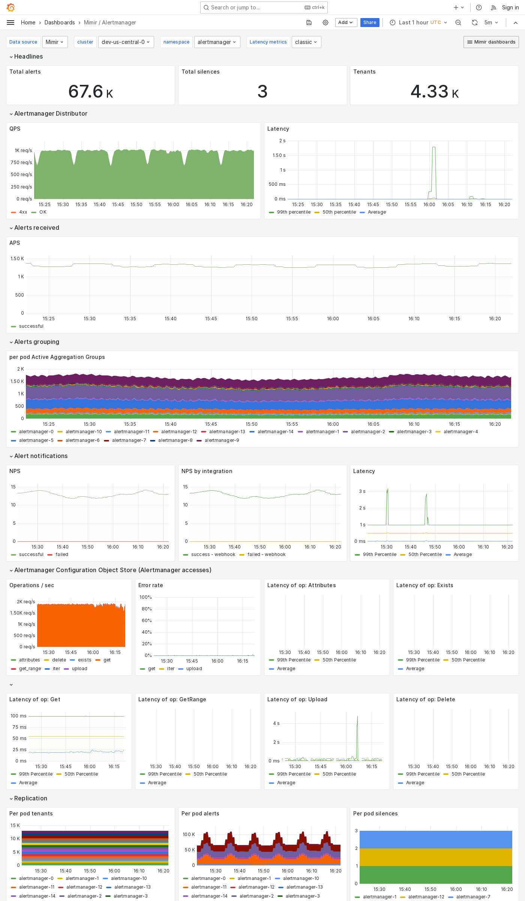

---
aliases:
  - ../../../operators-guide/monitor-grafana-mimir/dashboards/alertmanager/
  - ../../../operators-guide/monitoring-grafana-mimir/dashboards/alertmanager/
  - ../../../operators-guide/visualizing-metrics/dashboards/alertmanager/
description: View an example Alertmanager dashboard.
menuTitle: Alertmanager
title: Grafana Mimir Alertmanager dashboard
weight: 10
---

# Grafana Mimir Alertmanager dashboard

The Alertmanager dashboard shows health and activity metrics for the Alertmanager and object storage metrics for operations triggered by the Alertmanager.

Use this dashboard for the following use cases:

- Monitor the Alertmanager's overall performance and reliability.
- Track the operational status of the Alertmanager, ensuring it's running as expected and capable of processing incoming alerts.
- Observe metrics related to alert deduplication, grouping, and routing, which are essential for understanding how alerts are managed and delivered.
- Monitor interactions with object storage systems, such as the storage of alert states, to ensure data persistence and reliability.

## Example

The following example shows an Alertmanager dashboard from a demo cluster.

