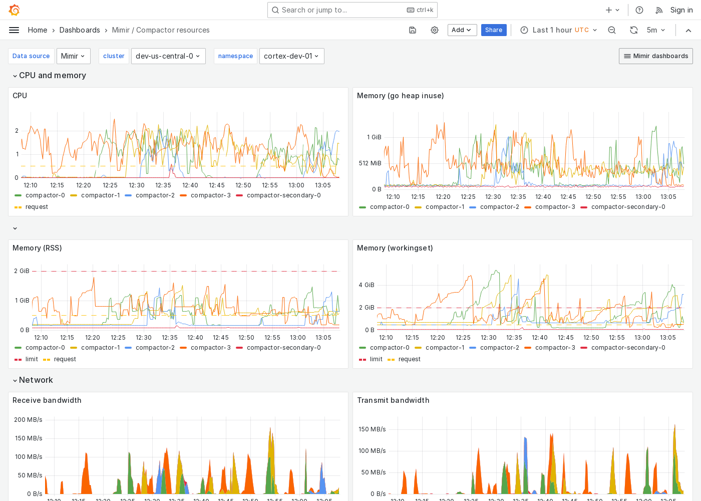

---
aliases:
  - ../../../operators-guide/monitor-grafana-mimir/dashboards/compactor-resources/
  - ../../../operators-guide/monitoring-grafana-mimir/dashboards/compactor-resources/
  - ../../../operators-guide/visualizing-metrics/dashboards/compactor-resources/
description: View an example Compactor resources dashboard.
menuTitle: Compactor resources
title: Grafana Mimir Compactor resources dashboard
weight: 40
---

# Grafana Mimir Compactor resources dashboard

The Compactor resources dashboard shows CPU, memory, disk, and networking metrics for the compactor.

Use this dashboard for the following use cases:

- Gain insight into the resource utilization of the compactor component within a Mimir cluster.
- Detect and analyze issues related to the compactor's resource consumption.
- Optimize the compactor's performance, ensuring efficient handling of compaction tasks without over-provisioning resources.

This dashboard requires [additional resources metrics](../../requirements/#additional-resources-metrics).

## Example

The following example shows a Compactor resources dashboard from a demo cluster.

