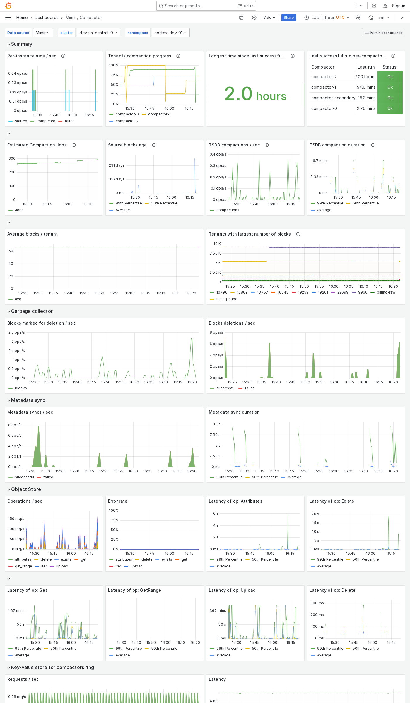

---
aliases:
  - ../../../operators-guide/monitor-grafana-mimir/dashboards/compactor/
  - ../../../operators-guide/monitoring-grafana-mimir/dashboards/compactor/
  - ../../../operators-guide/visualizing-metrics/dashboards/compactor/
description: View an example Compactor dashboard.
menuTitle: Compactor
title: Grafana Mimir Compactor dashboard
weight: 30
---

# Grafana Mimir Compactor dashboard

The Compactor dashboard shows health and activity metrics for the compactor and object storage metrics for operations triggered by the compactor.

Use this dashboard for the following use cases:

- Monitor compactor performance in a Mimir cluster.
- Track the operational status of the compactor, ensuring it's running as expected and performing compaction tasks efficiently.
- Observe metrics related to compaction operations, such as the number of blocks compacted, compaction durations, and any errors encountered during the process.
- Monitor the compactor's interactions with object storage.

## Example

The following example shows a Compactor dashboard from a demo cluster.

