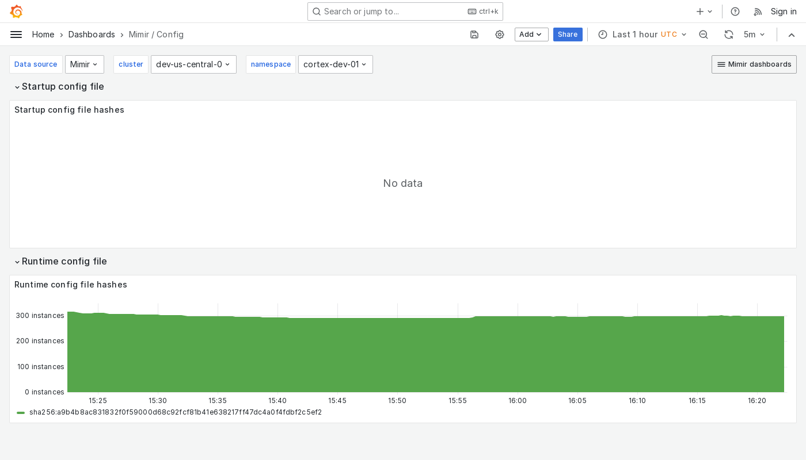

---
aliases:
  - ../../../operators-guide/monitor-grafana-mimir/dashboards/config/
  - ../../../operators-guide/monitoring-grafana-mimir/dashboards/config/
  - ../../../operators-guide/visualizing-metrics/dashboards/config/
description: View an example Config dashboard.
menuTitle: Config
title: Grafana Mimir Config dashboard
weight: 50
---

# Grafana Mimir Config dashboard

The Config dashboard shows details about the runtime configuration currently loaded by each Grafana Mimir instance.

Use this dashboard for the following use cases:

- Ensure that all instances in a Mimir cluster are running with the correct configuration settings.
- Compare configurations across instances to identify discrepancies that might lead to unexpected behavior.

## Example

The following example shows a Config dashboard from a demo cluster.

