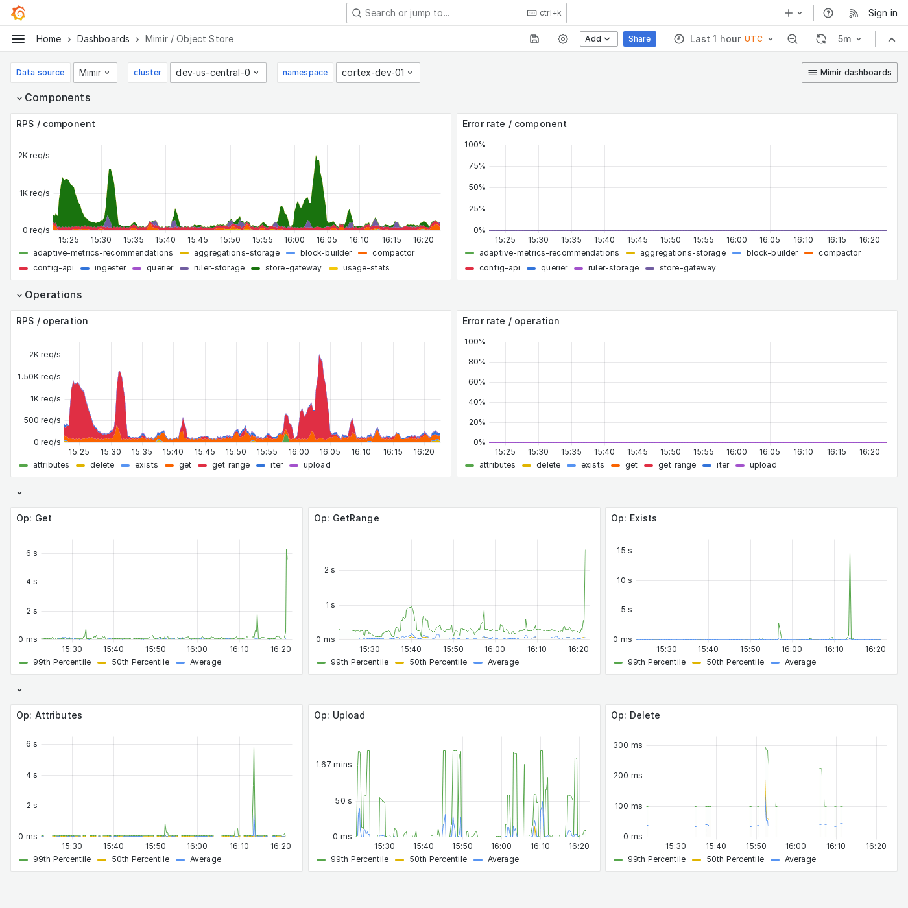

---
aliases:
  - ../../../operators-guide/monitor-grafana-mimir/dashboards/object-store/
  - ../../../operators-guide/monitoring-grafana-mimir/dashboards/object-store/
  - ../../../operators-guide/visualizing-metrics/dashboards/object-store/
description: View an example Object Store dashboard.
menuTitle: Object Store
title: Grafana Mimir Object Store dashboard
weight: 60
---

# Grafana Mimir Object Store dashboard

The Object Store dashboard shows an overview of all activity and operations run by any Grafana Mimir component on the object storage.

Use this dashboard for the following use cases:

- Identify which Mimir components are interacting with the object storage and assess their activity levels.
- Visualize ongoing read and write operations to the object storage, so that you can detect anomalies or performance issues.
- Detect failed operations or retries that may indicate underlying issues with the storage backend or network connectivity.
- Analyze metrics such as operation latency and throughput to ensure optimal performance of storage interactions.

## Example

The following example shows an Object Store dashboard from a demo cluster.

