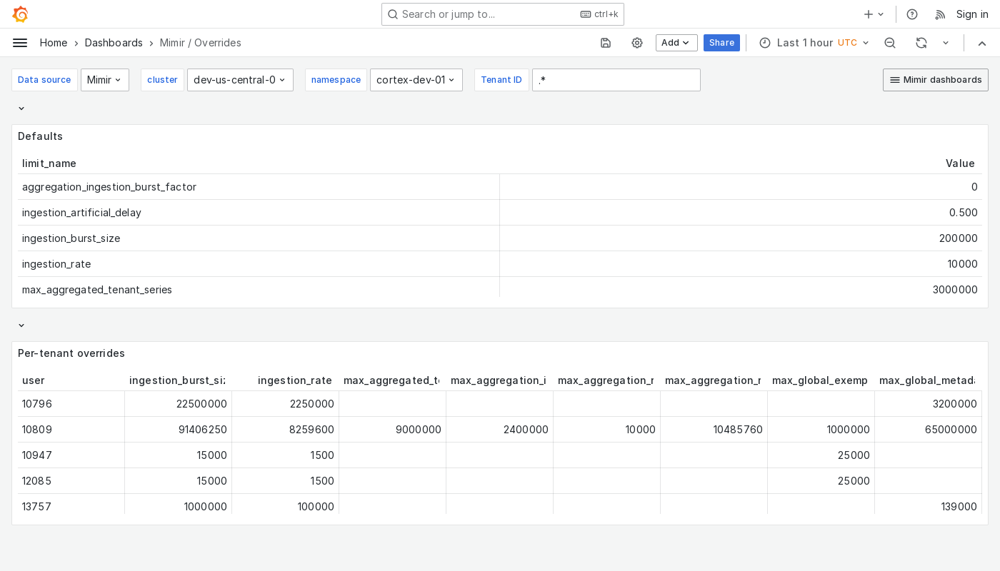

---
aliases:
  - ../../../operators-guide/monitor-grafana-mimir/dashboards/overrides/
  - ../../../operators-guide/monitoring-grafana-mimir/dashboards/overrides/
  - ../../../operators-guide/visualizing-metrics/dashboards/overrides/
description: View an example Overrides dashboard.
menuTitle: Overrides
title: Grafana Mimir Overrides dashboard
weight: 70
---

# Grafana Mimir Overrides dashboard

The Overrides dashboard shows global limits and per-tenant overrides.

Use this dashboard for the following use cases:

- View the global limits set for a cluster and any specific overrides applied to individual tenants.
- Verify that each tenant has the appropriate resource allocations.
- Troubleshoot issues related to resource constraints.
- Plan limits when onboarding new tenants or adjusting existing ones.

## Example

The following example shows an Overrides dashboard from a demo cluster.

