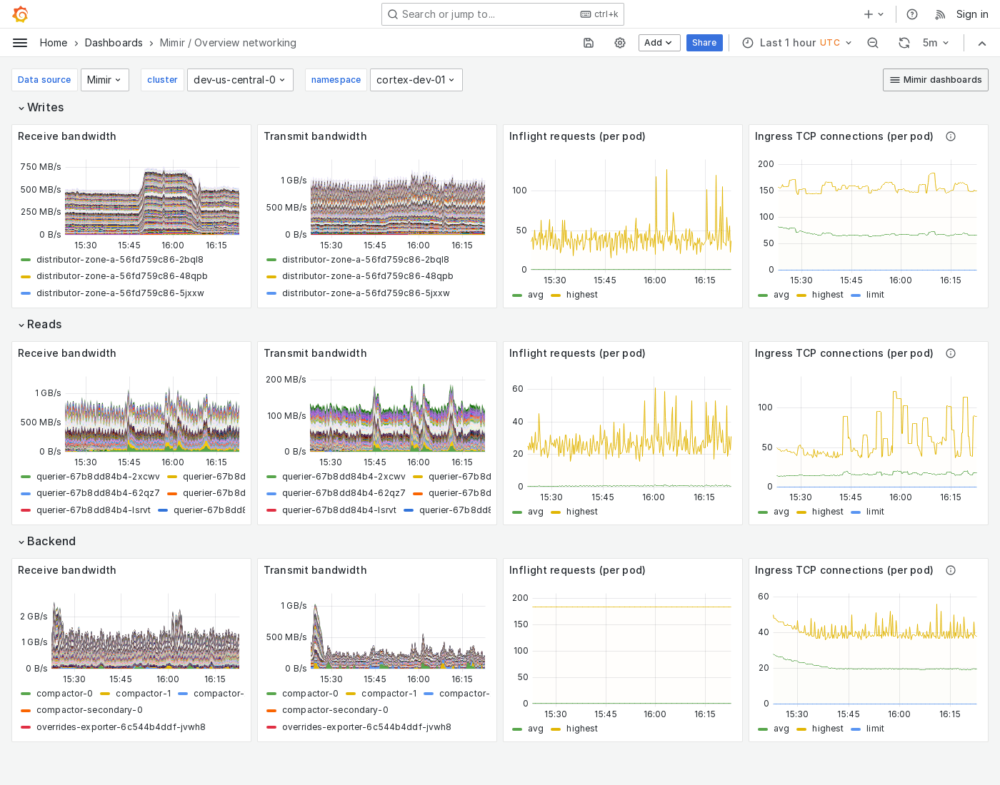

---
aliases:
  - ../../../operators-guide/monitor-grafana-mimir/dashboards/overview-networking/
description: View an example Overview networking dashboard.
menuTitle: Overview networking
title: Grafana Mimir Overview networking dashboard
weight: 7
---

# Grafana Mimir Overview networking dashboard

The Overview networking dashboard shows receive and transmit bandwidth, in-flight requests, and TCP connections.
The dashboard groups Mimir components into "Writes", "Reads", and "Backend".

Use this dashboard for the following use cases:

- Ensure that the network communication between components is performing optimally.
- Monitor sudden changes in network traffic or an increase in in-flight requests that could indicate potential issues that you need to address.
- Monitor TCP connections to identify potential bottlenecks or connection issues that could affect data ingestion and query performance.

This dashboard requires [additional resources metrics](../../requirements/#additional-resources-metrics).

## Example

The following example shows a Overview networking dashboard from a demo cluster.

