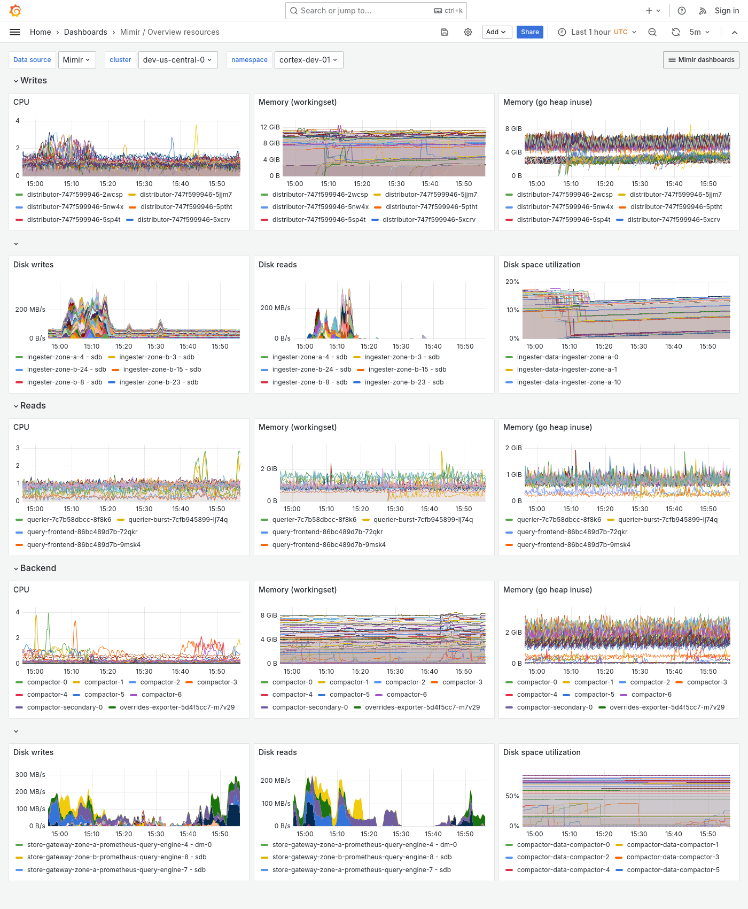

---
aliases:
  - ../../../operators-guide/monitor-grafana-mimir/dashboards/overview-resources/
description: View an example Overview resources dashboard.
menuTitle: Overview resources
title: Grafana Mimir Overview resources dashboard
weight: 6
---

# Grafana Mimir Overview resources dashboard

The Overview resources dashboard shows CPU, memory, disk, and other resource utilization metrics.
The dashboard groups Mimir components into "Writes", "Reads", and "Backend".

Use this dashboard for the following use cases:

- Monitor your cluster's component-based resource utilization.
- Perform real-time monitoring to surface any performance issues.
- Forecast upcoming resource needs based on current usage.
- Troubleshoot which component in your system is under stress.

This dashboard requires [additional resources metrics](../../requirements/#additional-resources-metrics).

## Example

The following example shows an Overview resources dashboard from a demo cluster.

