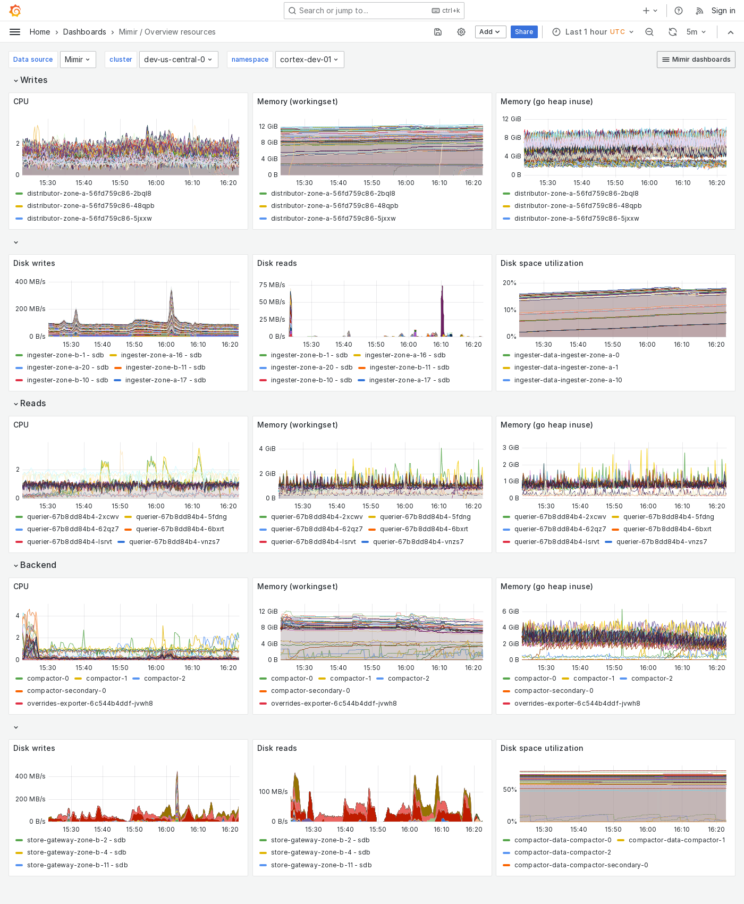

# Grafana Mimir Overview resources dashboard

The Overview resources dashboard shows CPU, memory, disk, and other resource utilization metrics.
The dashboard groups Mimir components into "Writes", "Reads" and "Backend".

This dashboard requires [additional resources metrics]().

## Example

The following example shows an Overview resources dashboard from a demo cluster.

