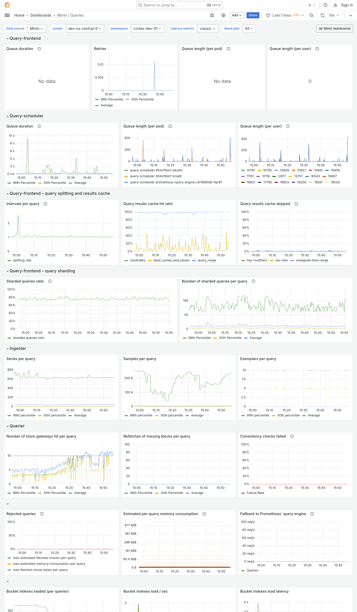

---
aliases:
  - ../../../operators-guide/monitor-grafana-mimir/dashboards/queries/
  - ../../../operators-guide/monitoring-grafana-mimir/dashboards/queries/
  - ../../../operators-guide/visualizing-metrics/dashboards/queries/
description: View an example Queries dashboard.
menuTitle: Queries
title: Grafana Mimir Queries dashboard
weight: 80
---

# Grafana Mimir Queries dashboard

The Queries dashboard shows information about query queues, duration, retries, and details about query execution performance.

Use this dashboard for the following use cases:

- Observe the length and behavior of query queues to detect potential backlogs or delays.
- Analyze query durations and retries to identify slow or failing queries.
- Fine-tune query parameters, caching strategies, or resource allocations for improved performance.

## Example

The following example shows a Queries dashboard from a demo cluster.

