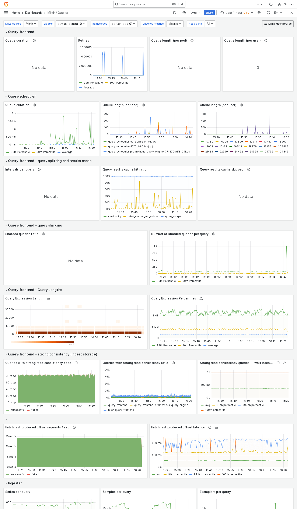

---
aliases:
  - ../../../operators-guide/monitor-grafana-mimir/dashboards/queries/
  - ../../../operators-guide/monitoring-grafana-mimir/dashboards/queries/
  - ../../../operators-guide/visualizing-metrics/dashboards/queries/
description: View an example Queries dashboard.
menuTitle: Queries
title: Grafana Mimir Queries dashboard
weight: 80
---

# Grafana Mimir Queries dashboard

The Queries dashboard shows information about query queues, duration, retries, and details about query execution performance.

## Example

The following example shows a Queries dashboard from a demo cluster.

