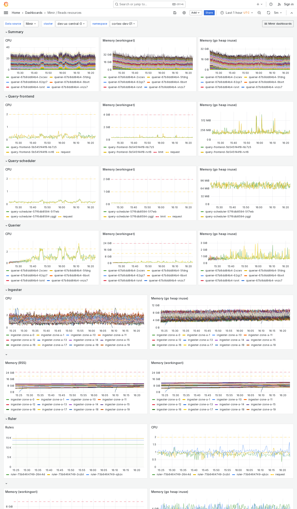

---
aliases:
  - ../../../operators-guide/monitor-grafana-mimir/dashboards/reads-resources/
  - ../../../operators-guide/monitoring-grafana-mimir/dashboards/reads-resources/
  - ../../../operators-guide/visualizing-metrics/dashboards/reads-resources/
description: View an example Reads resources dashboard.
menuTitle: Reads resources
title: Grafana Mimir Reads resources dashboard
weight: 110
---

# Grafana Mimir Reads resources dashboard

The Reads resources dashboard shows CPU, memory, disk, and other resources utilization metrics.
The dashboard isolates each service on the read path into its own section and displays the order in which a read request flows.

This dashboard requires [additional resources metrics](../../requirements/#additional-resources-metrics).

Use this dashboard for the following use cases:

- Diagnose performance issues in the read path.
- Identify which read path component is experiencing high resource usage.
- Monitor CPU, memory, and disk usage to identify resource bottlenecks that could affect query performance.

## Example

The following example shows a Reads resources dashboard from a demo cluster.

