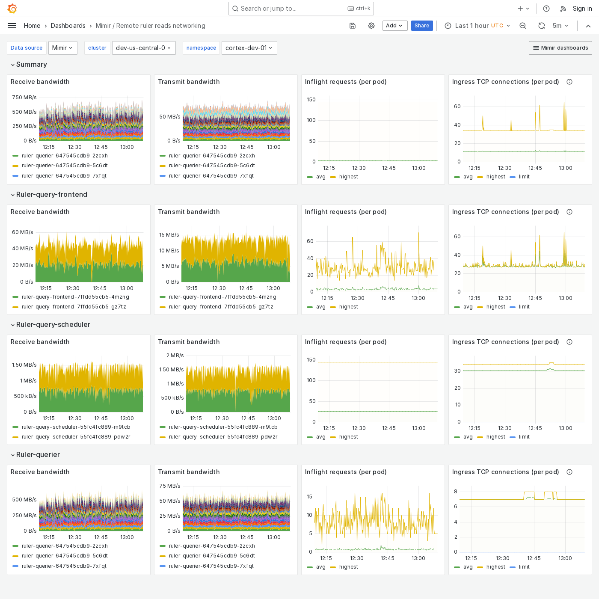

# Grafana Mimir Remote ruler reads networking dashboard

The Remote ruler reads networking dashboard shows receive and transmit bandwidth, in-flight requests, and TCP connections for ruler query path components when remote operational mode is enabled.
The dashboard isolates each service on the remote ruler read path into its own section and displays the order in which a read request flows.

This dashboard requires [additional resources metrics]().

## Example

The following example shows a Remote ruler reads networking dashboard from a demo cluster.

