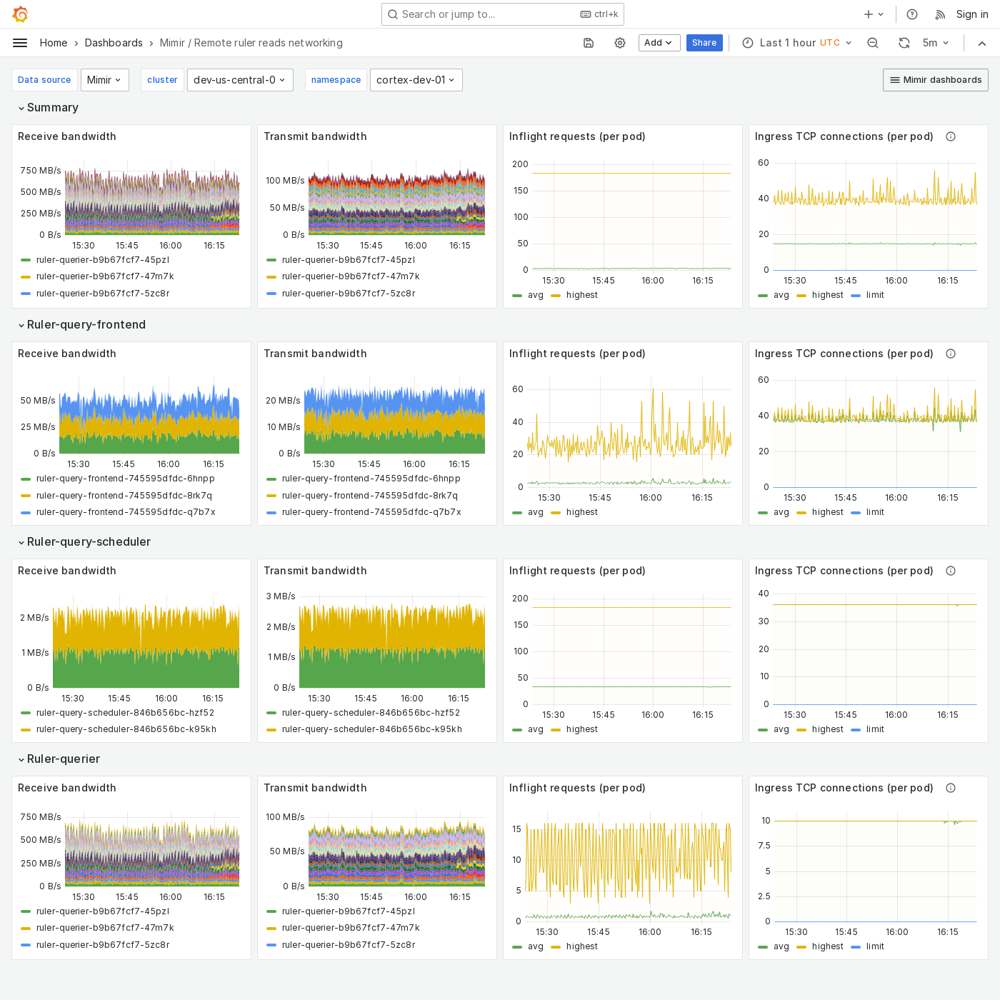

# Grafana Mimir Remote ruler reads networking dashboard

The Remote ruler reads networking dashboard shows receive and transmit bandwidth, in-flight requests, and TCP connections for ruler query path components when remote operational mode is enabled.
The dashboard isolates each service on the remote ruler read path into its own section and displays the order in which a read request flows.

This dashboard requires [additional resources metrics](../../requirements/#additional-resources-metrics).

Use this dashboard for the following use cases:

- Identify where in the ruler's read path errors and failures are occurring.
- Monitor bandwidth to determine if any component is experiencing network saturation or unusual traffic patterns.
- Monitor in-flight requests and TCP connections to identify potential bottlenecks or connection issues between services.

## Example

The following example shows a Remote ruler reads networking dashboard from a demo cluster.

