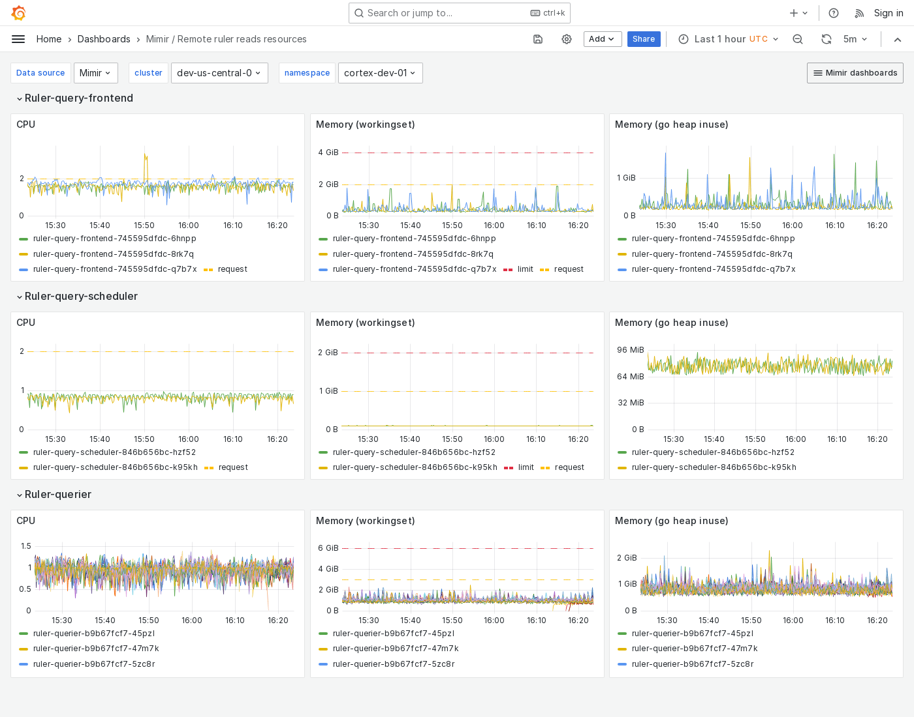

---
aliases:
  - ../../../operators-guide/monitor-grafana-mimir/dashboards/remote-ruler-reads-resources/
  - ../../../operators-guide/monitoring-grafana-mimir/dashboards/remote-ruler-reads-resources/
  - ../../../operators-guide/visualizing-metrics/dashboards/remote-ruler-reads-resources/
description: View an example Remote ruler reads resources dashboard.
menuTitle: Remote ruler reads resources
title: Grafana Mimir Remote ruler reads resources dashboard
weight: 110
---

# Grafana Mimir Remote ruler reads resources dashboard

The Remote ruler reads resources dashboard shows CPU, memory, disk, and other resource utilization metrics for ruler query path components when remote operational mode is enabled.

The dashboard isolates each service on the ruler read path into its own section and displays the order in which a read request flows.

This dashboard requires [additional resources metrics](../../requirements/#additional-resources-metrics).

Use this dashboard for the following use cases:

- Monitor resource utilization for ruler query path components when operating in remote evaluation mode.
- Gain insight into the performance and health of the components involved in remote rule evaluations.
- Visualize metrics like CPU usage, memory consumption, disk I/O, and network throughput for each component in real time.

## Example

The following example shows a Remote ruler reads resources dashboard from a demo cluster.

