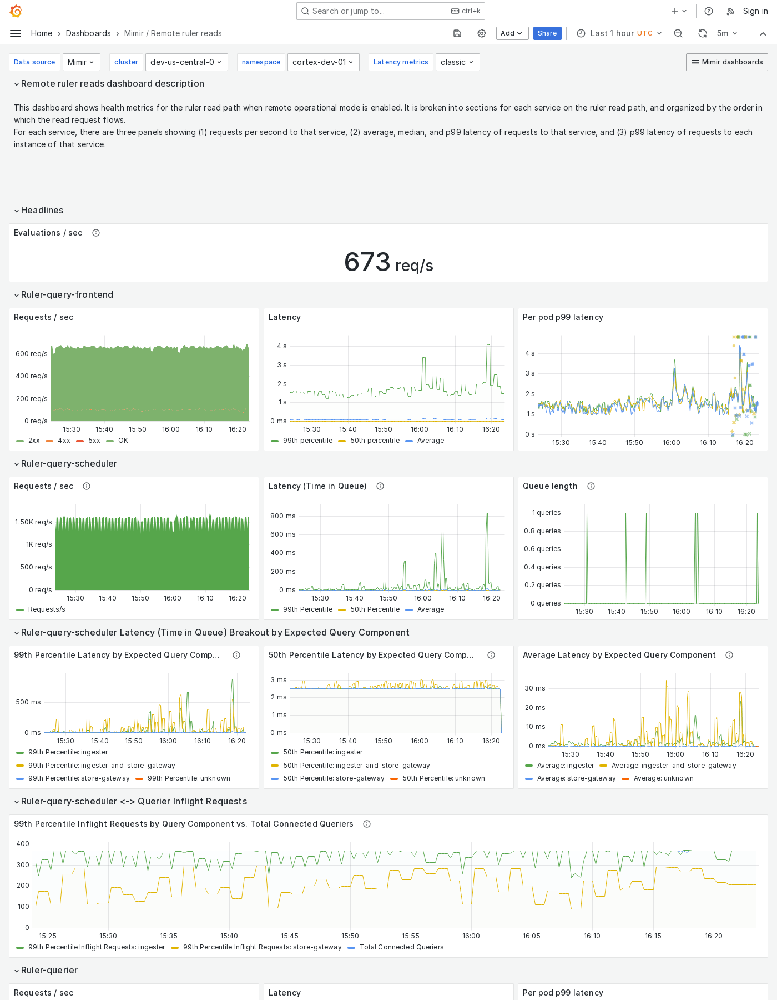

---
aliases:
  - ../../../operators-guide/monitor-grafana-mimir/dashboards/remote-ruler-reads/
  - ../../../operators-guide/monitoring-grafana-mimir/dashboards/remote-ruler-reads/
  - ../../../operators-guide/visualizing-metrics/dashboards/remote-ruler-reads/
description: View an example Remote ruler reads dashboard.
menuTitle: Remote ruler reads
title: Grafana Mimir Remote ruler reads dashboard
weight: 90
---

# Grafana Mimir Remote ruler reads dashboard

The Remote ruler reads dashboard shows health metrics for the ruler read path when remote operational mode is enabled.

The dashboard isolates each service on the ruler read path into its own section and displays the order in which a read request flows.

Use this dashboard for the following use cases:

- Isolate each service involved in the ruler's read path, such as the ruler-query-frontend, ruler-query-scheduler, and ruler-querier, to identify where delays or failures are occurring.
- Identify specific services that are experiencing errors or performance issues.
- Monitor performance of the ruler's read operations to assess whether the remote evaluation mode is functioning optimally.

## Example

The following example shows a Remote ruler reads dashboard from a demo cluster.

