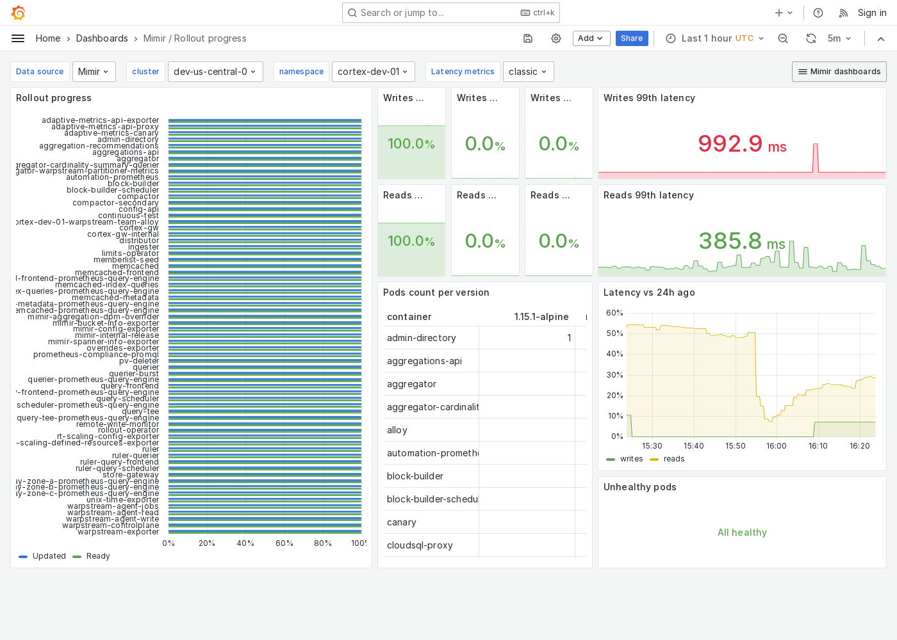

---
aliases:
  - ../../../operators-guide/monitor-grafana-mimir/dashboards/rollout-progress/
  - ../../../operators-guide/monitoring-grafana-mimir/dashboards/rollout-progress/
  - ../../../operators-guide/visualizing-metrics/dashboards/rollout-progress/
description: View an example Rollout progress dashboard.
menuTitle: Rollout progress
title: Grafana Mimir Rollout progress dashboard
weight: 120
---

# Grafana Mimir Rollout progress dashboard

The Rollout progress dashboard shows the progress of a rollout across a Grafana Mimir cluster and key metrics you can monitor, such as failure rates and latency.

Use this dashboard for the following use cases:

- Monitor a rolling update in a Mimir cluster.
- Visualize the rollout status across different components, such as store-gateways, alert managers, and rulers, to confirm that updates are proceeding as planned.
- Monitor failure rates to quickly identify and address issues that may arise during the update process.
- Observe latency metrics to ensure that the performance remains within acceptable parameters throughout the rollout.

## Example

The following example shows a Rollout progress dashboard from a demo cluster.

