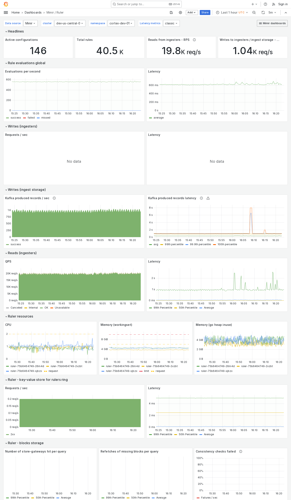

---
aliases:
  - ../../../operators-guide/monitor-grafana-mimir/dashboards/ruler/
  - ../../../operators-guide/monitoring-grafana-mimir/dashboards/ruler/
  - ../../../operators-guide/visualizing-metrics/dashboards/ruler/
description: View an example Ruler dashboard.
menuTitle: Ruler
title: Grafana Mimir Ruler dashboard
weight: 130
---

# Grafana Mimir Ruler dashboard

The Ruler dashboard shows health and activity metrics for the ruler and object storage metrics for operations triggered by the ruler.

## Example

The following example shows a Ruler dashboard from a demo cluster.


Even while operating in [Remote ruler mode]() there are still values for the `Read from ingesters - QPS`.


This is because the metrics are inclusive of intermediate services and are showing the requests that ultimately reach the ingesters.

For a more detailed view of the read path when using remote ruler mode, see the [Remote ruler reads]() dashboard.
