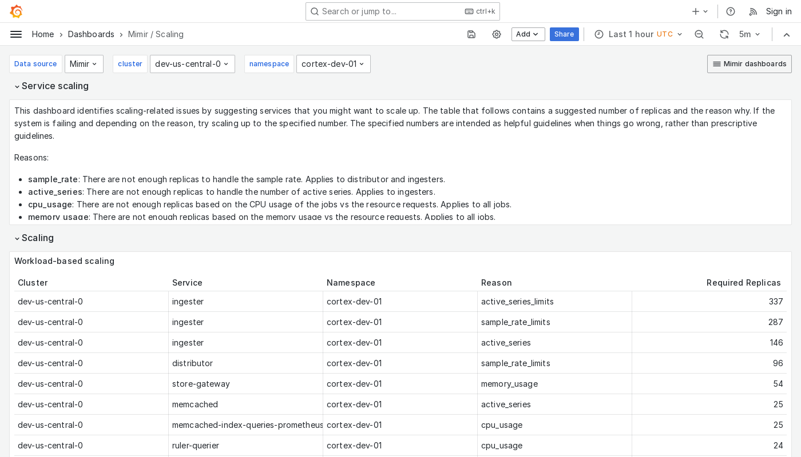

---
aliases:
  - ../../../operators-guide/monitor-grafana-mimir/dashboards/scaling/
  - ../../../operators-guide/monitoring-grafana-mimir/dashboards/scaling/
  - ../../../operators-guide/visualizing-metrics/dashboards/scaling/
description: View an example Scaling dashboard.
menuTitle: Scaling
title: Grafana Mimir scaling dashboard
weight: 140
---

# Grafana Mimir Scaling dashboard

The Scaling dashboard displays services that you can optionally scale up in the event of a failure caused by one or more reasons.

Use this dashboard for the following use cases:

- Identify which Mimir components require scaling in response to specific failures or performance issues.
- Review metrics for individual Mimir services, such as CPU usage versus request rates, to pinpoint which components are experiencing high load.
- Integrate with Mimir runbooks for detailed guidance on scaling strategies for various components.

## Example

The following example shows a Scaling dashboard from a demo cluster.

