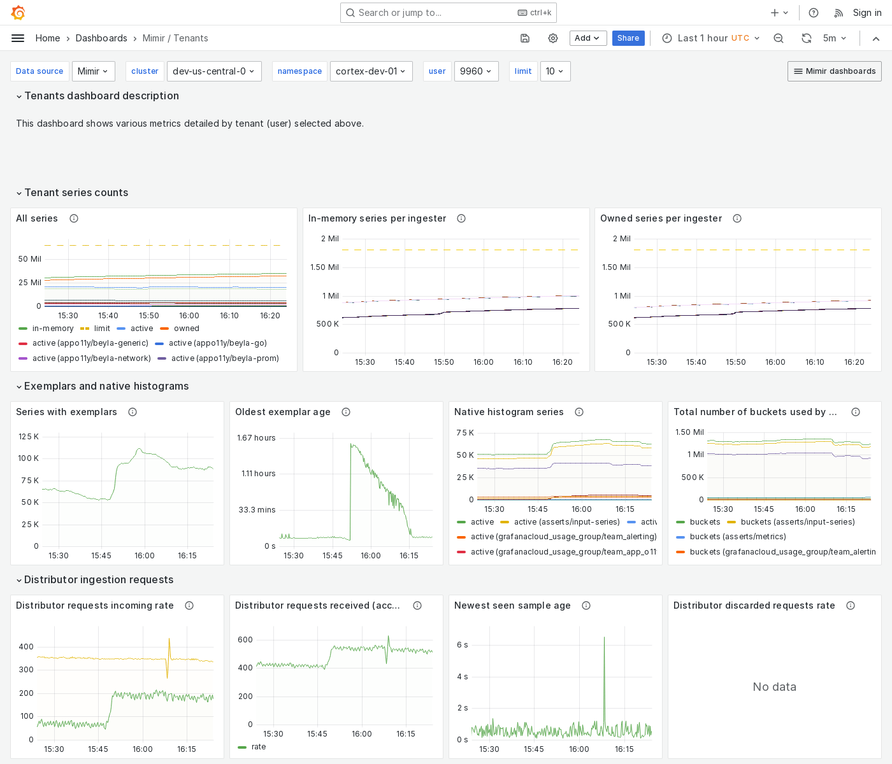

---
aliases:
  - ../../../operators-guide/monitor-grafana-mimir/dashboards/tenants/
  - ../../../operators-guide/monitoring-grafana-mimir/dashboards/tenants/
  - ../../../operators-guide/visualizing-metrics/dashboards/tenants/
description: View an example Tenants dashboard.
menuTitle: Tenants
title: Grafana Mimir Tenants dashboard
weight: 160
---

# Grafana Mimir Tenants dashboard

The Tenants dashboard shows various metrics for a selected tenant.

Use this dashboard for the following use cases:

- Isolate and analyze tenant-specific data in multi-tenant environments.
- View metrics specific to one tenant.
- Monitor a tenant's resource consumption, such as CPU and memory usage.

## Example

The following example shows a Tenants dashboard from a demo cluster.

