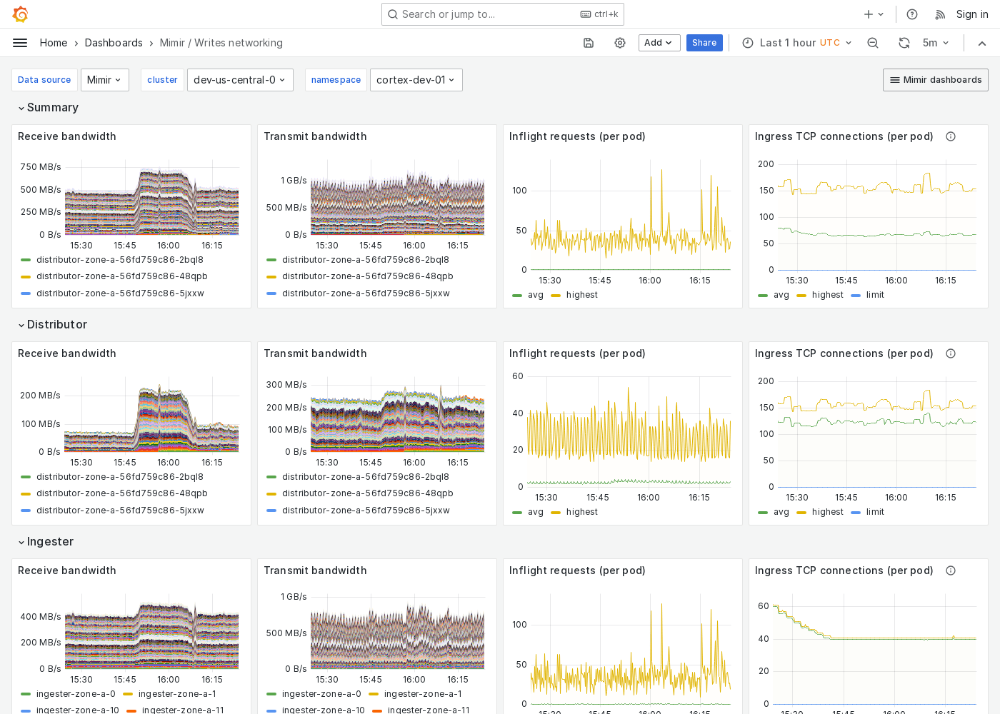

---
aliases:
  - ../../../operators-guide/monitor-grafana-mimir/dashboards/writes-networking/
  - ../../../operators-guide/monitoring-grafana-mimir/dashboards/writes-networking/
  - ../../../operators-guide/visualizing-metrics/dashboards/writes-networking/
description: View an example Writes networking dashboard.
menuTitle: Writes networking
title: Grafana Mimir Writes networking dashboard
weight: 190
---

# Grafana Mimir Writes networking dashboard

The Writes networking dashboard shows receive/transmit bandwidth, inflight requests, and TCP connections.
The dashboard isolates each service on the write path into its own section and displays the order in which a write request flows.

This dashboard requires [additional resources metrics](../../requirements/#additional-resources-metrics).

Use this dashboard for the following use cases:

- Monitor the network performance of the write path within a Mimir cluster.
- Identify where in the write path network delays or congestion are occurring.
- Diagnose networking bottlenecks in the write path.

## Example

The following example shows a Writes networking dashboard from a demo cluster.

