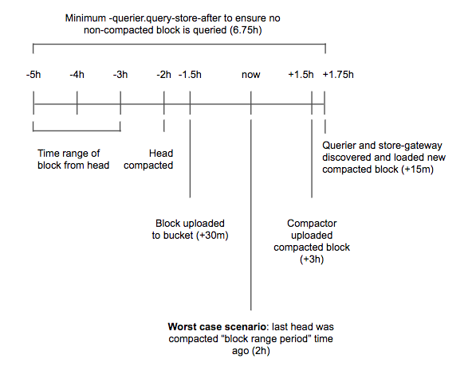

---
aliases:
  - ../../operators-guide/run-production-environment/production-tips/
  - ../../operators-guide/running-production-environment/production-tips/
description: Learn tips for setting up a production Grafana Mimir cluster.
menuTitle: Production tips
title: Grafana Mimir production tips
weight: 40
---

# Grafana Mimir production tips

This topic provides tips and techniques for you to consider when setting up a production Grafana Mimir cluster.

## Ingester

### Ensure a high maximum number of open file descriptors

The ingester receives samples from distributor, and appends the received samples to the specific per-tenant TSDB that is stored on the ingester local disk.
The per-tenant TSDB is composed of several files and the ingester keeps a file descriptor open for each TSDB file.
The total number of file descriptors, used to load TSDB files, linearly increases with the number of tenants in the Grafana Mimir cluster and the configured `-blocks-storage.tsdb.retention-period`.

We recommend fine-tuning the following settings to avoid reaching the maximum number of open file descriptors:

1. Configure the system's `file-max` ulimit to at least `65536`. Increase the limit to `1048576` when running a Grafana Mimir cluster with more than a thousand tenants.
1. Enable ingesters [shuffle sharding]() to reduce the number of tenants per ingester.

### Ingester disk space requirements

The ingester writes received samples to a write-ahead log (WAL) and by default, compacts them into a new block every two hours.
Both the WAL and blocks are temporarily stored on the local disk.
The required disk space depends on the number of time series stored in the ingester and the configured `-blocks-storage.tsdb.retention-period`.

For more information about estimating ingester disk space requirements, refer to [Planning capacity]().

### Ingester disk IOPS

The IOPS (input/output operations per second) and latency of the ingester disks can affect both write and read requests.
On the write path, the ingester writes to the write-ahead log (WAL) on disk.
On the read path, the ingester reads from the series whose chunks have already been written to disk.

For these reasons, run the ingesters on disks such as SSDs that have fast disk speed.

### Resource utilization based ingester read path limiting

The ingester supports limiting read requests based on resource (CPU/memory) utilization, in order to protect the write path.
The ingester write path is generally considered more important than the read path in production, so it's (often) better to
limit read requests when ingesters are under pressure than to fail writes (or even crash).

We recommend enabling resource utilization based ingester read path limiting, to protect ingesters from potentially getting overwhelmed by expensive queries.
For more information on its configuration, refer to [ingester]().

## Querier

### Ensure caching is enabled

The querier supports caching to reduce the number API requests to the long-term storage.

We recommend enabling caching in the querier.
For more information about configuring the cache, refer to [querier]().

### Avoid querying non-compacted blocks

When running Grafana Mimir at scale, querying non-compacted blocks might be inefficient for the following reasons:

- Non-compacted blocks contain duplicated samples, as a result of the ingesters replication.
- Querying many small TSDB indexes is slower than querying a few compacted TSDB indexes.

The default values for `-querier.query-store-after`, `-querier.query-ingesters-within`, and `-blocks-storage.bucket-store.ignore-blocks-within` are set such that only compacted blocks are queried. In most cases, no additional configuration is required.

Configure Grafana Mimir so large tenants are parallelized by the compactor:

1. Configure compactor's `-compactor.split-and-merge-shards` and `-compactor.split-groups` for every tenant with more than 20 million active time series. For more information about configuring the compactor's split and merge shards, refer to [compactor]().

#### How to estimate `-querier.query-store-after`

If you are not using the defaults, set the `-querier.query-store-after` to a duration that is large enough to give compactor enough time to compact newly uploaded blocks, and queriers and store-gateways to discover and synchronize newly compacted blocks.

The following diagram shows all of the timings involved in the estimation. This diagram should be used only as a template and you can modify the assumptions based on real measurements in your Mimir cluster. The example makes the following assumptions:

- An ingester takes up to 30 minutes to upload a block to the storage
- The compactor takes up to three hours to compact two-hour blocks shipped from all ingesters
- Querier and store-gateways take up to 15 minutes to discover and load a new compacted block

Based on these assumptions, in the worst-case scenario, it takes up to six hours and 45 minutes from when a sample is ingested until that sample has been appended to a block flushed to the storage and the block is [vertically compacted]() with all other overlapping two-hour blocks shipped from ingesters.

[//]: # "Diagram source at https://docs.google.com/presentation/d/1bHp8_zcoWCYoNU2AhO2lSagQyuIrghkCncViSqn14cU/edit"

## Store-gateway

### Ensure caching is enabled

The store-gateway supports caching that reduces the number of API calls to the long-term storage and improves query performance.

We recommend enabling caching in the store-gateway.
For more information about configuring the cache, refer to [store-gateway]().

### Ensure a high number of maximum open file descriptors

The store-gateway stores each block’s index-header on the local disk and loads it via memory mapping.
The store-gateway keeps a file descriptor open for each index-header loaded at a given time.
The total number of file descriptors used to load index-headers linearly increases with the number of blocks owned by the store-gateway instance.

We recommend configuring the system's `file-max` ulimit at least to `65536` to avoid reaching the maximum number of open file descriptors.

### Store-gateway disk IOPS

The IOPS and latency of the store-gateway disk can affect queries.
The store-gateway downloads the block’s [index-headers]() onto local disk, and reads them for each query that needs to fetch data from the long-term storage.

For these reasons, run the store-gateways on disks such as SSDs that have fast disk speed.

## Compactor

### Ensure the compactor has enough disk space

The compactor requires a lot of disk space to download source blocks from the long-term storage and temporarily store the compacted block before uploading it to the storage.
For more information about required disk space, refer to [Compactor disk utilization]().

## Caching

### Ensure Memcached is properly scaled

We recommend ensuring Memcached evictions happen infrequently.
Grafana Mimir query performance might be negatively affected if your Memcached cluster evicts items frequently.
We recommend increasing your Memcached cluster replicas to add more memory to the cluster and reduce evictions.

We also recommend running a dedicated Memcached cluster for each type of cache since each Mimir uses each differently and they scale differently.
Separation also isolates each cache from the others so that one type of cache entry doesn't crowd out other entries and degrade performance.

The metadata cache stores information about files in object storage, contents of auxiliary files such as bucket indexes, and discovered information about object storage such as lists of tenants.
This results in relatively low CPU and bandwidth usage.

The query results cache to stores query responses.
Entries in this cache tend to be small and Mimir only fetches a few at a time.
This results in relatively low CPU and bandwidth usage.

The index caches store portions of the TSDB index fetched from object storage.
Entries in this cache vary in size from a few hundred bytes to several megabytes.
Mimir fetches entries both individually and in batches.
A single query may fetch many entries from the cache.
This results in higher CPU usage compared to other caches.

The chunks caches store portions of time series samples fetched from object storage.
Entries in this cache tend to be large (several kilobytes) and are fetched in batches by the store-gateway components.
This results in higher bandwidth usage compared to other caches.

### Cache size

Memcached [extstore](https://docs.memcached.org/features/flashstorage/) feature allows to extend Memcached’s memory space onto flash (or similar) storage.

Refer to [how we scaled Grafana Cloud Logs' Memcached cluster to 50TB and improved reliability](https://grafana.com/blog/2023/08/23/how-we-scaled-grafana-cloud-logs-memcached-cluster-to-50tb-and-improved-reliability/).

## Security

We recommend securing the Grafana Mimir cluster.
For more information about securing a Mimir cluster, refer to [Secure Grafana Mimir]().

## Network

Most of the communication between Mimir components occurs over gRPC. The gRPC
connection does not use any compression by default.

If network throughput is a concern or a high cost, then you can enable compression on the gRPC connection between
components. This will reduce the network throughput at the cost of increased CPU usage. You can choose between gzip and
snappy. Gzip provides better compression than snappy at the cost of more CPU usage.

You can use the [Squash Compression Benchmark](http://quixdb.github.io/squash-benchmark/#results-table) to choose between snappy and gzip.
For protobuf data snappy achieves a compression ratio of 5 with compression speeds of
around 400MiB/s. For the same data gzip achieves a ratio between 6 and 8 with speeds between 50MiB/s and 135 MiB/s.

To configure gRPC compression, use the following CLI flags or their YAML equivalents. The accepted values are
`snappy` and `gzip`. If you set the flag to an empty string (`''`), it explicitly disables compression.

| CLI flag                                                    | YAML option                                                |
| ----------------------------------------------------------- | ---------------------------------------------------------- |
| `-query-frontend.grpc-client-config.grpc-compression`       | `alertmanager.alertmanager_client.grpc_compression`        |
| `-query-scheduler.grpc-client-config.grpc-compression`      | `frontend.grpc_client_config.grpc_compression`             |
| `-ruler.client.grpc-compression`                            | `frontend_worker.grpc_client_config.grpc_compression`      |
| `-ruler.query-frontend.grpc-client-config.grpc-compression` | `ingester_client.grpc_client_config.grpc_compression`      |
| `-alertmanager.alertmanager-client.grpc-compression`        | `query_scheduler.grpc_client_config.grpc_compression`      |
| `-ingester.client.grpc-compression`                         | `ruler.query_frontend.grpc_client_config.grpc_compression` |

## Heavy multi-tenancy

For each tenant, Mimir opens and maintains a TSDB in memory. If you have a significant number of tenants, the memory overhead might become prohibitive.
To reduce the associated overhead, consider the following:

- Reduce `-blocks-storage.tsdb.head-chunks-write-buffer-size-bytes`, default `4MB`. For example, try `1MB` or `128KB`.
- Reduce `-blocks-storage.tsdb.stripe-size`, default `16384`. For example, try `256`, or even `64`.
- Configure [shuffle sharding](https://grafana.com/docs/mimir/latest/configure/configure-shuffle-sharding/)

## Periodic latency spikes when cutting blocks

Depending on the workload, you might witness latency spikes when Mimir cuts blocks.
To reduce the impact of this behavior, consider the following:

- Upgrade to `2.15+`. Refer to <https://github.com/grafana/mimir/commit/03f2f06e1247e997a0246d72f5c2c1fd9bd386df>.
- Reduce `-blocks-storage.tsdb.block-ranges-period`, default `2h`. For example. try `1h`.
