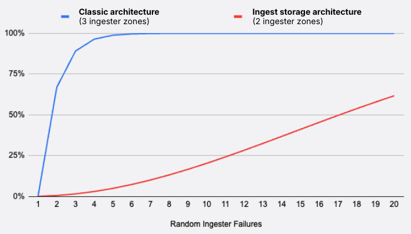

---
aliases:
  - ../../../operators-guide/architecture/components/ingester/
description: The ingester writes incoming series to long-term storage.
menuTitle: Ingester
title: Grafana Mimir ingester
weight: 30
---

# Grafana Mimir ingester

The ingester is a stateful component that processes the most recently ingested samples and makes them available for querying.
[Queriers](https://grafana.com/docs/mimir/<MIMIR_VERSION>/references/architecture/querier/) read recent data from ingesters and older data from long-term object storage via [store-gateways](https://grafana.com/docs/mimir/<MIMIR_VERSION>/references/architecture/store-gateway/).

The ingester stores data both in memory and on disk for a configurable retention period.
In-memory series are periodically compacted into an on-disk format called a TSDB block and then uploaded to object storage. This process happens every two hours by default.
When the local retention period expires and the data has been compacted and successfully uploaded, the ingester removes the local copy.

At that point, queriers retrieve the data from object storage through the store-gateways.

To recover its in-memory state after a crash or restart, the ingester maintains both a [write-ahead log](#write-ahead-log) (WAL) and a [write-behind log](#write-behind-log) (WBL).
The WBL is used only when out-of-order sample ingestion is enabled.

## Series ingestion and querying

How ingesters receive series and how queriers read from them differs between the ingest storage and classic architectures.

### Series ingestion and querying in ingest storage architecture


This guidance applies to ingest storage architecture. For more information about the supported architectures in Grafana Mimir, refer to [Grafana Mimir architecture](https://grafana.com/docs/mimir/<MIMIR_VERSION>/get-started/about-grafana-mimir-architecture/).


In ingest storage architecture, distributors shard incoming series across Kafka partitions, writing each series to a single partition.
A write request is considered successful once all series in the request are committed to Kafka.

Ingesters are not involved in the write path, so their availability does not impact writes.
Effectively, ingesters act as pure read-path components.

Each ingester owns a single Kafka partition and continuously consumes series data from that partition, making it available for querying.
As a result, data from a completed write request is not immediately queryable, but becomes available shortly afterward once the ingester has processed it.
In steady state, this latency is typically below one second.

Kafka ensures high availability and durability for the most recent data.
When an ingester restarts or crashes, it quickly catches up with the backlog of series written to Kafka during its downtime.
This ensures that ingesters have gap-free series data once they are caught up.

This behavior is key because it allows a read quorum of one per partition. Queriers reading the most recent data from ingesters need to query only a single ingester for the relevant partition to guarantee consistency.
Even if two random ingesters are unavailable, the read path remains healthy as long as there is at least one healthy ingester for each partition.

An ingester owns exactly one Kafka partition, but a partition can be assigned to multiple ingesters for high availability. As a best practice, assign two ingesters per partition. This corresponds to a replication factor of two.

For more information about sharding, refer to [Series sharding in ingest storage architecture](https://grafana.com/docs/mimir/<MIMIR_VERSION>/references/architecture/hash-ring/#series-sharding-in-ingest-storage-architecture).

### Series ingestion and querying in classic architecture


This guidance applies to classic architecture. For more information about the supported architectures in Grafana Mimir, refer to [Grafana Mimir architecture](https://grafana.com/docs/mimir/<MIMIR_VERSION>/get-started/about-grafana-mimir-architecture/).


In classic architecture, distributors shard and replicate incoming series across ingesters, writing each series to `RF` different ingesters, where `RF` is the replication factor, three, by default.
A write request is considered successful once all series are written to a quorum of ingesters, calculated based on the configured `RF`.
For example, with an `RF` of three, a write request succeeds if each series is successfully written to at least two ingesters.

In this architecture, ingesters are involved in both the write and read paths.
If two or more ingesters become unavailable, the write and read quorum may be lost, potentially causing a full outage.

When an ingester restarts or crashes, it cannot catch up with series that were written to its shard during downtime.
This can result in gaps in the ingester’s data.
Consequently, queriers also require a read quorum to guarantee consistency.
A query succeeds if each series can be read from at least a quorum of ingesters that own that series.
For example, with an `RF` of three, a read request succeeds if each series is successfully read from at least two ingesters.

For more information about sharding, refer to [Series sharding in classic architecture](https://grafana.com/docs/mimir/<MIMIR_VERSION>/references/architecture/hash-ring/#series-sharding-in-classic-architecture).

### Differences in read path availability between ingest storage and classic architecture

Because the read quorum behavior differs between the two architectures, ingest storage architecture is significantly more resilient to ingester failures.

The following chart models the probability of a read-path outage given a variable number of random unhealthy ingesters.
We assumed 100 ingesters per zone, with three zones for the classic architecture (`RF` = 3) and two zones for the ingest storage architecture (`RF` = 2).

Even with a lower replication factor, and therefore, fewer ingesters, ingest storage architecture is more resilient to random failures:

- In classic architecture, an outage occurs as soon as two ingesters in two different zones are unhealthy.
- In the ingest storage architecture, an outage only occurs if two ingesters owning the same partition are simultaneously unhealthy.

[//]: # "Diagram source at https://docs.google.com/presentation/d/1bHp8_zcoWCYoNU2AhO2lSagQyuIrghkCncViSqn14cU/edit"

### Zone-aware replication

Zone-aware replication ensures that the ingester replicas for a given time series are distributed across different zones. Zones can represent logical or physical failure domains, for example, different availability zones in the cloud. Dividing replicas across multiple zones helps prevent data loss and service interruptions during a zone-wide outage.

To set up multi-zone replication, refer to [Configure Grafana Mimir zone-aware replication](https://grafana.com/docs/mimir/<MIMIR_VERSION>/configure/configure-zone-aware-replication/).

### Shuffle sharding

Shuffle sharding is a technique used by Grafana Mimir to minimize the impact tenants have on each other.
It works by isolating each tenant’s data across different partitions or ingesters, reducing overlap between tenants.

For more information on shuffle sharding, refer to [Configuring shuffle sharding](https://grafana.com/docs/mimir/<MIMIR_VERSION>/configure/configure-shuffle-sharding/).

## Ingesters hash ring

Ingesters join a dedicated [hash ring](https://grafana.com/docs/mimir/<MIMIR_VERSION>/references/architecture/hash-ring/).
In classic architecture, the ring is used for sharding and service discovery.
In ingest storage architecture, it’s used for service discovery only.

Regardless of the architecture, each ingester in the ring has a state that changes throughout its lifecycle:

{}
| State | Description |
| --- | --- |
| `PENDING` | The ingester has started but its bootstrap phase hasn’t begun. In this state, it does not ingest series or serve read requests. |
| `JOINING` | The ingester is bootstrapping and preparing to serve read requests. In classic architecture, it replays the WAL and WBL. In ingest storage architecture, it replays the WAL and WBL, then catches up with the backlog of series accumulated in its Kafka partition since the previous shutdown. |
| `ACTIVE` | The ingester is fully operational. It ingests series and serves read requests. |
| `LEAVING` | The ingester is shutting down. It stops ingesting series and serving read requests. |
| `UNHEALTHY` | A meta state derived from heartbeat monitoring. An ingester is considered `UNHEALTHY` if it fails to update its heartbeat timestamp within a configurable timeout. Other components avoid contacting ingesters in this state. In particular, queriers skip `UNHEALTHY` ingesters when reading. In classic architecture, distributors avoid writing to them. |
{}

To configure the ingesters hash ring, refer to [Configure Grafana Mimir hash rings](https://grafana.com/docs/mimir/<MIMIR_VERSION>/configure/configure-hash-rings/).

### Read-only mode


This feature is used exclusively in classic architecture. For more information about the supported architectures in Grafana Mimir, refer to [Grafana Mimir architecture](https://grafana.com/docs/mimir/<MIMIR_VERSION>/get-started/about-grafana-mimir-architecture/).


Ingesters have an additional property in the ring called "read-only" mode.
This information is stored separately from the ingester’s instance state, so an ingester can be in any supported state, for example, `ACTIVE` or `LEAVING`, while also being in read-only mode.

When an ingester is in read-only mode, it stops receiving write requests from distributors but continues to serve read requests.
In the write path, read-only ingesters are excluded from the shard computation used for distributing tenant writes.

Read-only mode is particularly useful during downscaling or as preparation for an ingester’s shutdown.
Ingesters can be placed in read-only mode using the [Prepare instance ring downscale](https://grafana.com/docs/mimir/<MIMIR_VERSION>/references/http-api/#prepare-instance-ring-downscale) API endpoint.

## Write-ahead and write-behind logs

The ingester uses a write-ahead log (WAL) and a write-behind log (WBL) to recover its in-memory state after a restart or crash.
These logs protect against data loss caused by process restarts or failures but do not protect against disk failures.
They also do not improve availability. Replication is still required for high availability.

### Write-ahead log

The write-ahead log (WAL) records all incoming series to persistent disk until those series are uploaded to long-term storage.
If an ingester fails, it replays the WAL on restart to restore the in-memory series and samples.

### Write-behind log

The write-behind log (WBL) functions similarly to the WAL but records only out-of-order samples to persistent storage until they are uploaded to long-term storage.
The WBL is used only when out-of-order ingestion is enabled via the CLI flag `-ingester.out-of-order-time-window`.

Grafana Mimir uses a separate log for out-of-order samples because the WAL is optimized for in-order appends.
When an ingester receives a sample, it first tries to append it to in-memory data structures.
If the sample is out-of-order and out-of-order ingestion is enabled, the ingester still appends it in memory and writes it to the dedicated write-behind log.

For more information about out-of-order samples ingestion, refer to [Configure out of order samples ingestion](https://grafana.com/docs/mimir/<MIMIR_VERSION>/configure/configure-out-of-order-samples-ingestion/).
