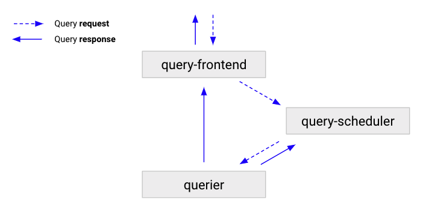

---
aliases:
  - ../../../operators-guide/architecture/components/query-frontend/
description: The query-frontend accelerates queries.
menuTitle: Query-frontend
title: Grafana Mimir query-frontend
weight: 60
---

# Grafana Mimir query-frontend

The query-frontend is a stateless component that provides a [Prometheus compatible API](https://prometheus.io/docs/prometheus/latest/querying/api/) with a number of features to accelerate the read path.
The query-frontend is the primary entry point for the read path of Mimir.
The query-scheduler and queriers are required within the cluster to execute the queries.

We recommend that you run at least two query-frontend replicas for high-availability reasons.

[//]: # "Diagram source at https://docs.google.com/presentation/d/1bHp8_zcoWCYoNU2AhO2lSagQyuIrghkCncViSqn14cU/edit"

The following flow describes how a query moves through a Grafana Mimir cluster:

1. The query-frontend receives queries, and then either splits and shards them, or serves them from the cache.
1. The query-frontend enqueues the queries into a [query-scheduler](../query-scheduler/).
1. The query-scheduler stores the queries in an in-memory queue where they wait for a querier to pick them up.
1. Queriers pick up the queries, and executes them.
1. The querier sends results back to query-frontend, which then forwards the results to the client.

## Functions

This section describes the functions of the query-frontend.

### Splitting

The query-frontend can split long-range queries into multiple queries.
By default, the split interval is 24 hours.
The query-frontend executes these queries in parallel in downstream queriers and combines the results together.
Splitting prevents large multi-day or multi-month queries from causing out-of-memory errors in a querier and accelerates query execution.

### Caching

The query-frontend caches query results and reuses them on subsequent queries.
If the cached results are incomplete, the query-frontend calculates the required partial queries and executes them in parallel on downstream queriers.
The query-frontend can optionally align queries with their step parameter to improve the cacheability of the query results.
The result cache is backed by Memcached.

Although aligning the step parameter to the query time range increases the performance of Grafana Mimir, it violates the [PromQL conformance](https://prometheus.io/blog/2021/05/03/introducing-prometheus-conformance-program/) of Grafana Mimir. If PromQL conformance is not a priority to you, you can enable step alignment by setting `-query-frontend.align-queries-with-step=true` or the equivalent per-tenant setting `align_queries_with_step`.

### About query sharding

The query-frontend also provides [query sharding](../../query-sharding/).

## DNS configuration and readiness

When a query-frontend starts up, it is not immediately able to serve queries.
The [`/ready` endpoint](../../../http-api/#readiness-probe) reports an HTTP 200 status code only after the query-frontend connects to at least one query-scheduler, and is then ready to serve queries.
Configure the `/ready` endpoint as a healthcheck in your load balancer; otherwise, a query-frontend scale-out event might result in failed queries or high latency until the query-frontend connects to a query-scheduler.
