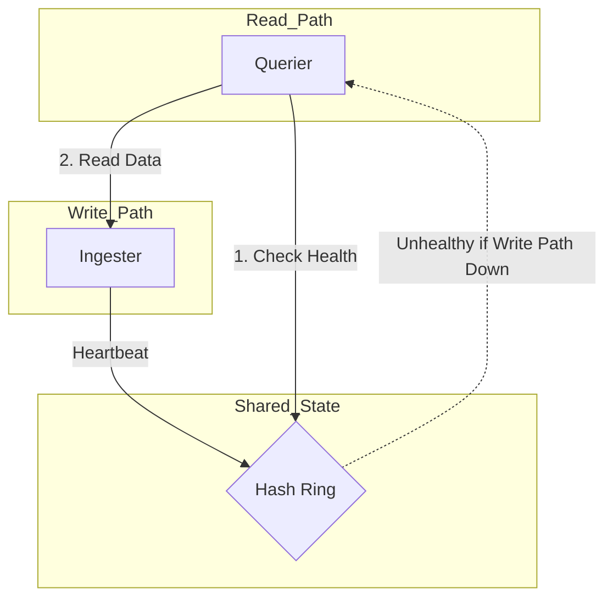

---
aliases:
  - ../../operators-guide/architecture/deployment-modes/
description: You can deploy Grafana Mimir in either monolithic mode or microservices mode.
menuTitle: Deployment modes
title: Grafana Mimir deployment modes
weight: 20
---

# Grafana Mimir deployment modes

Grafana Mimir offers two deployment modes to accommodate different operational requirements and scale needs. Choose the deployment mode that best fits your use case:

- Monolithic mode: Run all components in a single process for simple deployments.
- Microservices mode: Deploy components separately for maximum scalability and flexibility.

Configure the deployment mode using the `-target` parameter, which you can set via CLI flag or YAML configuration.

## About monolithic mode

Monolithic mode runs all required components in a single process. This mode is ideal for getting started or running Grafana Mimir in a development environment.

To enable monolithic mode, set `-target=all`.

To see the complete list of components that run in monolithic mode, use the `-modules` flag:

```bash
./mimir -modules
```

[//]: # "Diagram source at https://docs.google.com/presentation/d/1LemaTVqa4Lf_tpql060vVoDGXrthp-Pie_SQL7qwHjc/edit#slide=id.g11694eaa76e_0_0"

This diagram shows how Mimir works in monolithic mode:


### Scale monolithic mode

You can horizontally scale monolithic mode by deploying multiple Mimir binaries with `-target=all`. This approach, shown in the following diagram, provides high availability and increased scale without the configuration complexity of [microservices mode](#about-microservices-mode).

[//]: # "Diagram source at https://docs.google.com/presentation/d/1LemaTVqa4Lf_tpql060vVoDGXrthp-Pie_SQL7qwHjc/edit#slide=id.g11658e7e4c6_1_20"



Because monolithic mode requires scaling all Grafana Mimir components together, this deployment mode isn't recommended for large-scale deployments.


## About microservices mode

Microservices mode deploys each component in separate processes, enabling independent scaling and creating granular failure domains. Microservices mode is recommended for production environments.


Even though the read path (query-frontend, querier, store-gateway) runs separately from the write path (distributor, ingester), a healthy ring is typically required for successful queries. If the write components (distributor or ingester) are unavailable or unhealthy, the ring health check may fail, causing read queries to fail. Complete isolation of read vs. write availability requires careful configuration of ring settings and failure tolerance.




The following diagrams show how Mimir works in microservices mode using ingest storage and classic architectures. For more information about the two supported architectures in Grafana Mimir, refer to [Grafana Mimir architecture](https://grafana.com/docs/mimir/<MIMIR_VERSION>/get-started/about-grafana-mimir-architecture/).

Ingest storage architecture:

<div align="center">


</div>

Classic architecture:

[//]: # "Diagram source at https://docs.google.com/presentation/d/1LemaTVqa4Lf_tpql060vVoDGXrthp-Pie_SQL7qwHjc/edit#slide=id.g11658e7e4c6_1_53"


In microservices mode, each Grafana Mimir process is invoked with its `-target` parameter set to a specific Grafana Mimir component (for example, `-target=ingester` or `-target=distributor`). To get a working Grafana Mimir instance, you must deploy every required component. For more information about each of the Grafana Mimir components, refer to [Grafana Mimir advanced architecture](https://grafana.com/docs/mimir/<GRAFANA_VERSION>/references/architecture/).

To deploy Grafana Mimir in microservices mode, use [Kubernetes](https://kubernetes.io/) and the [mimir-distributed Helm chart](https://github.com/grafana/mimir/tree/main/operations/helm/charts/mimir-distributed).
