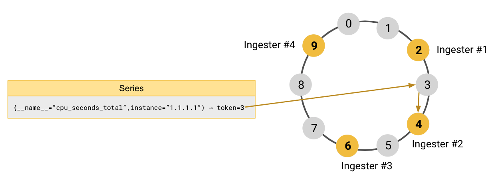

---
aliases:
  - ../../operators-guide/architecture/hash-ring/
description: Hash rings distribute sharding and replication work among Grafana Mimir components.
menuTitle: Hash rings
title: Grafana Mimir hash rings
weight: 60
---

<!-- Note: This topic is mounted in the GEM documentation. Ensure that all updates are also applicable to GEM. -->

# Grafana Mimir hash rings

Hash rings are a distributed [consistent hashing scheme](https://en.wikipedia.org/wiki/Consistent_hashing) that Grafana Mimir uses for sharding, replication, and service discovery.

The following Mimir features are built on top of hash rings:

- **Service discovery**: Instances can discover each other by looking up which peers are registered in the ring.
- **Health check**: Instances periodically send a heartbeat to the ring to signal that they are alive. An instance is considered unhealthy if it misses heartbeats for a configured period.
- **Zone-aware replication**: Optionally replicate data across failure domains for high availability. For more information, see [configuring zone-aware replication](../../../configure/configure-zone-aware-replication/).
- **Shuffle sharding**: Optionally limit the blast radius of failures in a multi-tenant cluster by isolating tenants. For more information, refer to [configure shuffle sharding](../../../configure/configure-shuffle-sharding/).

## How the hash ring is used for sharding

The primary use of hash rings in Mimir is sharding data (for example, time series) and workloads (for example, compaction jobs) in a consistent way — without a central coordinator or single point of failure.

Each of the following Mimir components joins its own dedicated hash ring for sharding:

- [Ingesters](../components/ingester/) – shard and replicate series.
- [Compactors](../components/compactor/) – shard compaction jobs.
- [Store-gateways](../components/store-gateway/) – shard blocks to query from long-term storage.
- [(Optional) Rulers](../components/ruler/) – shard rule groups to evaluate.
- [(Optional) Alertmanagers](../components/alertmanager/) – shard tenants.

A hash ring is a data structure that represents the data space as 32-bit unsigned integers.
Each instance of a Mimir component owns a set of token ranges that define which portion of the data space it is responsible for.

When an instance starts, it generates a fixed number of tokens and registers them in the ring.
Each token maps to a value in the 32-bit integer space.
A token is owned by the instance that registered the smallest value greater than the token being looked up (wrapping around to zero after `(2^32)-1`).

The data or workload to be sharded is hashed using a function that returns a 32-bit unsigned integer, called a token.
The instance that owns that token handles the data.

Hash rings provide **consistent hashing**.
When an instance joins or leaves the ring, only a small, bounded portion of data moves.
On average, only `n/m` tokens move, where `n` is the total number of tokens (32-bit unsigned integer) and `m` is the number of instances that are registered in the ring.

## How series sharding works

The most important hash ring in Grafana Mimir is the one used to shard series.
The implementation details depend on the configured architecture.

### How series sharding works in ingest storage architecture


This guidance applies to ingest storage architecture. For more information about the supported architectures in Grafana Mimir, refer to [Grafana Mimir architecture](https://grafana.com/docs/mimir/<MIMIR_VERSION>/get-started/about-grafana-mimir-architecture/).


In the ingest storage architecture, [distributors](../components/distributor/) shard incoming series across Kafka partitions.
Each series is assigned to a single Kafka partition and is not replicated across multiple partitions, because Kafka itself provides replication.

[Ingesters](../components/ingester/) owns Kafka partitions, consuming the series written to the partitions they own and making those series available for querying.
Each ingester owns one partition, but multiple ingesters can own the same partition for high availability.

Series sharding in the ingest storage architecture relies on two hash rings that work together:

- Partitions ring
- Ingesters ring

#### Write path

The partitions ring is the source of truth for the Kafka partitions currently used by Grafana Mimir.
Each partition owns a range of tokens used to shard series among partitions and includes the unique identifiers of the ingesters that own that partition.

When a distributor receives a write request containing series data:

1.	It hashes each series using the `fnv32a` hashing function.
2.	It looks up the resulting token in the partitions ring to determine the Kafka partition for that series.
3.	It writes the series to the matching Kafka partition.

A write request is considered successful when all series in the request are successfully committed to Kafka.

#### Read path

The ingesters ring is the source of truth for all ingesters currently running in the Grafana Mimir cluster and is used for service discovery.
Each ingester registers itself in the ring and periodically updates its heartbeat.

[Queriers](../components/querier/) watch the ingesters ring to identify alive ingesters and their IP addresses. When a querier receives a query:

1.	It looks up the partitions ring to find which partitions contain the relevant data.
2.	It looks up the ingesters ring to find which ingesters own those partitions.
3.	It fetches the matching series by contacting the ingesters that own the partitions.

In the ingest storage architecture, consistency is guaranteed with quorum 1.
This means each partition needs to be queried only once.
If multiple ingesters own the same partition, the querier fetches data from only one of the alive ingesters for that partition.

#### Partitions ring lifecycle

A partition in the ring can be in one of the following states:

- `Pending` – no writes or reads are allowed.
- `Active` – the partition is in read-write mode.
- `Inactive` – the partition is in read-only mode.

Partitions are not live components and cannot register themselves in the ring.
Their lifecycle is managed by ingesters.
Each ingester manages the lifecycle of the partition it owns.

When ingesters are scaled out, new partitions are added to the ring.
When ingesters are scaled in, their partitions are removed from the ring through a decommissioning procedure described below.

##### Partition creation and activation

When an ingester starts up, it checks whether the partition it owns already exists in the ring.
If the partition does not exist, the ingester creates it in the `Pending` state and adds itself as the partition owner.

This is the initial state for a new partition, allowing time for additional ingesters to join as owners and for ring changes to propagate across instances.
While a partition is in the `Pending` state, distributors cannot write to it, and queriers cannot read from it.

After the partition has at least one owner and remains in `Pending` for longer than a configured grace period, the ingester transitions it to the `Active` state.
When a partition is `Active`, distributors can write to it, and queriers must read from it.
This is the normal operational state of a partition.

[//]: # "Diagram source at https://docs.google.com/presentation/d/1bHp8_zcoWCYoNU2AhO2lSagQyuIrghkCncViSqn14cU/edit"

##### Partition decommissioning and downscaling

Partition and ingester downscaling are managed by Grafana's [Kubernetes Rollout Operator](https://github.com/grafana/rollout-operator).

When an ingester is marked for termination due to a downscaling event, the Rollout Operator invokes the "prepare delayed downscale endpoint" API exposed by the ingester.
This API switches the partition from `Active` to `Inactive`.

When a partition is `Inactive`, distributors can no longer write to it, but queriers must still read from it.
The partition remains in this state until it is safe to stop querying the ingester — specifically, when the data has become available for querying from long-term object storage.

Once the grace period passes, the Rollout Operator invokes a second API exposed by the ingester, the "prepare shutdown endpoint".
This API removes the ingester as a partition owner from the ring.
If the partition has no remaining owners, it is then removed from the ring entirely.

Finally, the Rollout Operator terminates the ingester pod, completing the safe downscaling procedure.

[//]: # "Diagram source at https://docs.google.com/presentation/d/1bHp8_zcoWCYoNU2AhO2lSagQyuIrghkCncViSqn14cU/edit"

### How series sharding works in classic architecture


This guidance applies to classic architecture. For more information about the supported architectures in Grafana Mimir, refer to [Grafana Mimir architecture](https://grafana.com/docs/mimir/<MIMIR_VERSION>/get-started/about-grafana-mimir-architecture/).


In the classic architecture, [distributors](../components/distributor/) shard and replicate the incoming series among [ingesters](../components/ingester/).

Each ingester joins a the ingesters hash ring and owns a subset of token ranges.
When a distributor receives a write request containing series data, it hashes each series using the `fnv32a` hashing function.
It then looks up the resulting token in the ingesters hash ring to find the authoritative owner and replicates the series to the next `RF - 1` ingesters in the ring (where `RF` is the replication factor, `3` by default).
Then the distributor write the series to the `RF` ingesters owning the series itself.

To better understand how it works, take four ingesters and a tokens space between `0` and `9` as an example:

- Ingester #1 is registered in the ring with the token `2`
- Ingester #2 is registered in the ring with the token `4`
- Ingester #3 is registered in the ring with the token `6`
- Ingester #4 is registered in the ring with the token `9`

A distributor receives an incoming sample for the series `{__name__="cpu_seconds_total",instance="1.1.1.1"}`.
It hashes the series’ labels, and the result of the hashing function is the token `3`.

To find which ingester owns token `3`, the distributor looks up the token `3` in the ingesters ring and finds the ingester that is registered with the smallest token larger than `3`.
The ingester #2, which is registered with token `4`, is the authoritative owner of the series `{__name__="cpu_seconds_total",instance="1.1.1.1"}`.

[//]: # "Diagram source at https://docs.google.com/presentation/d/1bHp8_zcoWCYoNU2AhO2lSagQyuIrghkCncViSqn14cU/edit"

By default, Grafana Mimir replicates each series to three ingesters.
After finding the authoritative owner of the series, the distributor continues to walk the ring clockwise to find the remaining two instances where the series should be replicated.
In the example that follows, the series are replicated to the instances of `Ingester #3` and `Ingester #4`.

[//]: # "Diagram source at https://docs.google.com/presentation/d/1bHp8_zcoWCYoNU2AhO2lSagQyuIrghkCncViSqn14cU/edit"

## How the hash ring is used for service discovery

Grafana Mimir also uses the ring for built-in service discovery.
Since instances register themselves in their ring and periodically send heartbeats, it becomes very convenient using the hash ring for internal service discovery as well.

When the hash ring is used exclusively for service discovery (not sharding), instances do **not** register tokens in the ring.
Instead, they only register their presence and periodically update a heartbeat timestamp.
When other instances need to find the alive instances of a given component, they lookup the ring to find the instances that have successfully updated the heartbeat the ring.

The Grafana Mimir components using the ring for service discovery or coordination are:

- [Distributors](../components/distributor/) – enforce global rate limits as local limits by dividing the global limit by the number of alive distributor instances.
- [Query-schedulers](../components/query-scheduler/) – allow query-frontends and queriers to discover available schedulers.
- [(Optional) Overrides-exporters](../components/overrides-exporter/) – self-elect a leader among replicas to export high-cardinality metrics (no strict leader election required).

## How a hash ring is shared between Grafana Mimir instances

Hash ring data structures need to be shared between Grafana Mimir instances.
To propagate changes to a given hash ring, Grafana Mimir uses a key-value store.
The key-value store is required and can be configured independently for the hash rings of different components.

For more information, see the [key-value store documentation](../key-value-store/).
