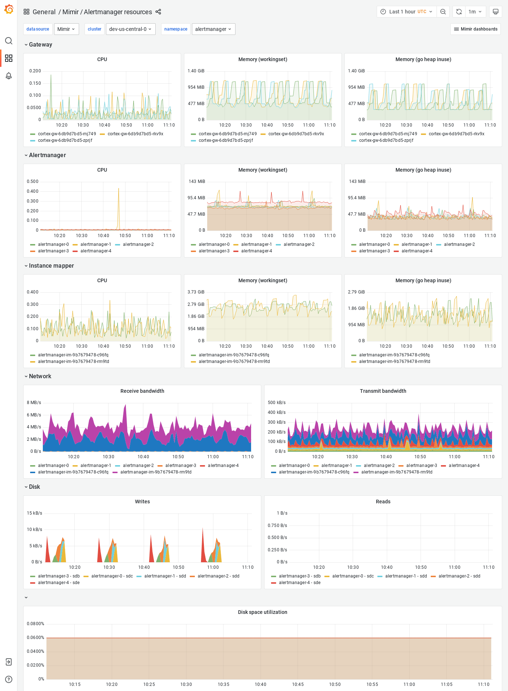

# Alertmanager resources

The Alertmanager resources dashboard shows CPU, memory, disk and networking metrics for the Alertmanager.

This dashboard requires [additional resources metrics]().

## Example

The following example shows an Alertmanager resources dashboard from a demo cluster.

