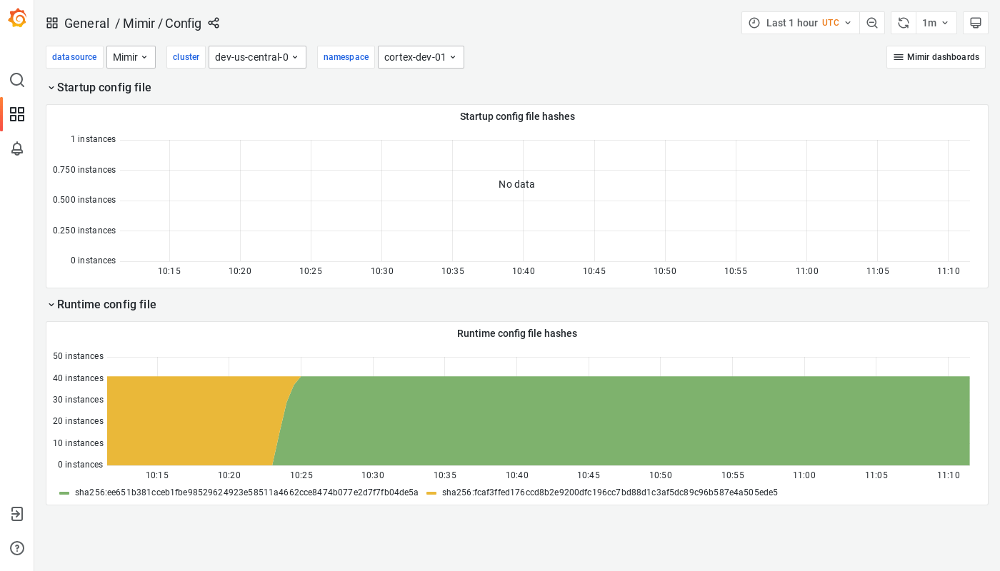

# Config

The Config dashboard shows details about the runtime configuration currently loaded by each Grafana Mimir instance.

## Example

The following example shows a Config dashboard from a demo cluster.

