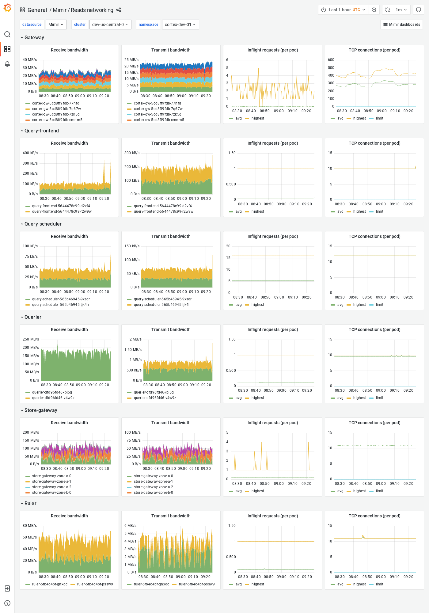

# Reads networking

The Reads networking dashboard shows receive and transmit bandwidth, in-flight requests, and TCP connections.
The dashboard isolates each service on the read path into its own section and displays the order in which a read request flows.

This dashboard requires Kubernetes networking metrics.

## Example

The following example shows a Reads networking dashboard from a demo cluster.

