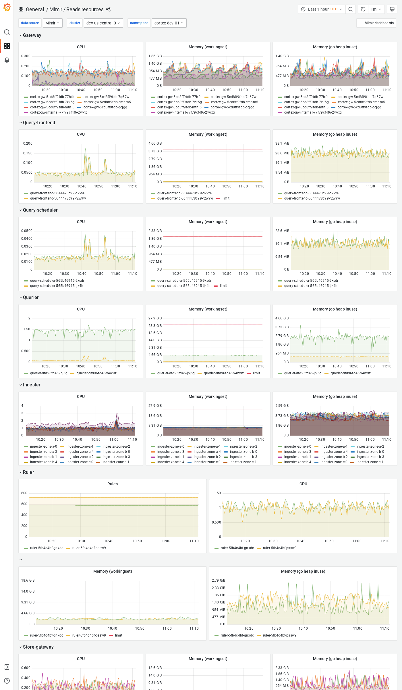

# Reads resources

The Reads resources dashboard shows CPU, memory, disk, and other resources utilization metrics.
The dashboard isolates each service on the read path into its own section and displays the order in which a read request flows.

This dashboard requires [additional resources metrics]().

## Example

The following example shows a Reads resources dashboard from a demo cluster.

