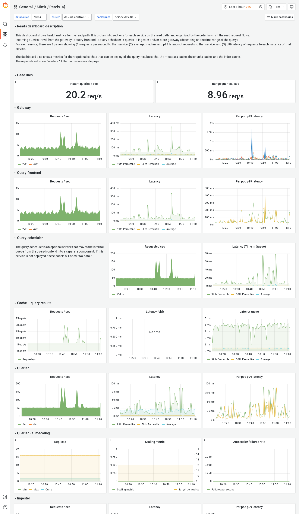

# Reads

The Reads dashboard shows health metrics for the read path and object storage metrics for operations triggered by the read path.

The dashboard isolates each service on the read path into its own section and displays the order in which a read request flows.

## Example

The following example shows a Reads dashboard from a demo cluster.

