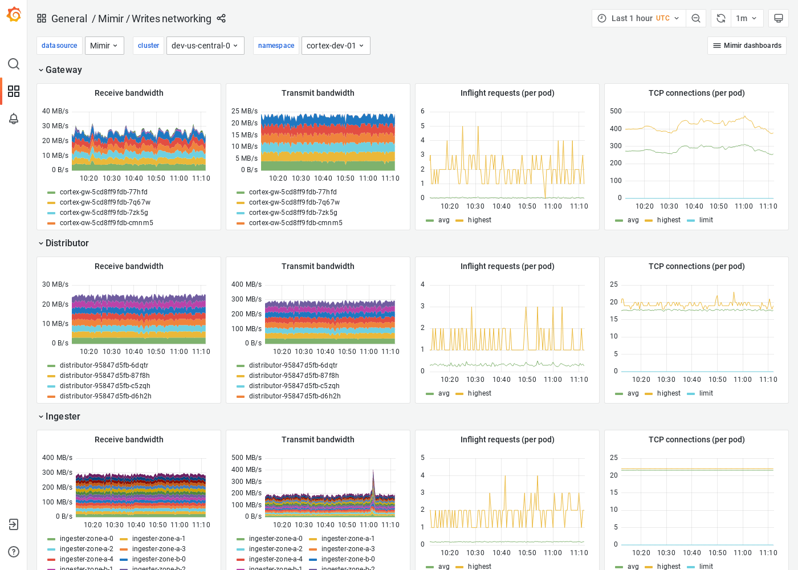

# Writes networking

The Writes networking dashboard shows receive/transmit bandwidth, inflight requests, and TCP connections.
The dashboard isolates each service on the write path into its own section and displays the order in which a write request flows.

This dashboard requires [additional resources metrics]().

## Example

The following example shows a Writes networking dashboard from a demo cluster.

