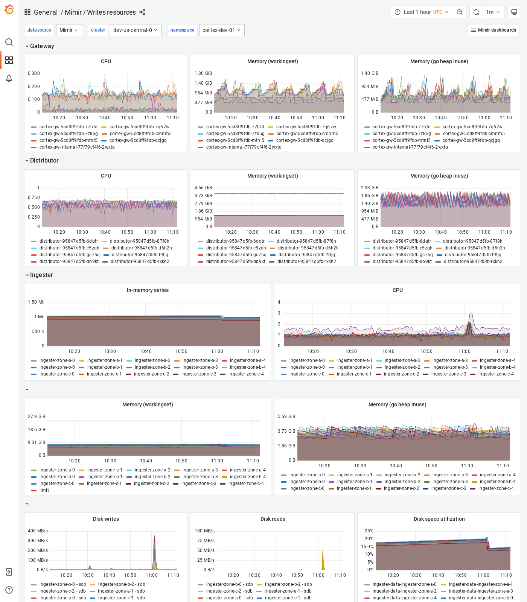

# Writes resources

The Writes resources dashboard shows CPU, memory, disk, and other resource utilization metrics.
The dashboard isolates each service on the write path into its own section and displays the order in which a write request flows.

This dashboard requires Kubernetes resources metrics.

## Example

The following example shows a Writes resources dashboard from a demo cluster.

