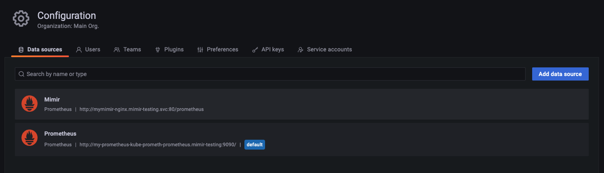

---
aliases:
  - /docs/mimir/latest/operators-guide/configuring/setting-helm-ha-deduplication-consul/
description: Learn how to configure Grafana Mimir Helm Chart to handle HA Prometheus server deduplication with Consul.
menuTitle: Configuring Helm Chart for high-availability deduplication with Consul
title: Configuring Helm Chart for high-availability deduplication with Consul
weight: 70
---

# Configuring Grafana Mimir Helm Chart for high-availability deduplication with Consul
Grafana Mimir can deduplicate data from high-availability (HA) Prometheus setup. In this guide, you will see how to configure
the deduplication for Grafana Mimir helm deployment using external Consul.

## Before you begin

You need a Kubernetes cluster. 
[Getting Started with Helm]() documentation
describe the cluster requirement.

Refer to [Configuring High Availability]() documents 
for high level description on the concept. You also should read 
[Getting Started with Helm]() on how
to install Grafana Mimir using helm.

You will need Prometheus in HA setup and Consul. You will be guided on the setup if you haven't had one.

## Install Prometheus HA using Helm

You can install Prometheus HA in Kubernetes using 
[kube-prometheus-stack helm chart](https://github.com/prometheus-community/helm-charts/tree/main/charts/kube-prometheus-stack). 
You can follow the step on installing the chart from that documentation. Once the chart is installed, use the 
following yaml file named `values.yaml` for the Prometheus HA setup. You also can have Grafana datasource
to be provisioned so that you can verify the Mimir HA deduplication later.

```yaml
prometheus:
  prometheusSpec:
    replicas: 2 # to enable HA, 2 is the minimum number of replica
    replicaExternalLabelName: "__replica__" # this config must match with ha_replica_label config in Mimir
    externalLabels:
      cluster: "my-prometheus" # this config must match with ha_cluster_label config in Mimir
    remoteWrite:
      - url: http://<mimir_endpoint>/api/v1/push
grafana:
  adminPassword: <put-admin-password>
  # Provision Mimir's datasource
  additionalDataSources:
    - name: Mimir
      url:  http://<mimir-endpoint>/prometheus
      type: prometheus
      editable: true
```

The above Helm yaml file will generate the following Prometheus configuration.

```yaml
global:
  scrape_interval: 1m
  scrape_timeout: 10s
  evaluation_interval: 1m
  external_labels:
    __replica__: prometheus-my-prometheus-kube-prometh-prometheus-x # x is the replica number
    cluster: my-prometheus
```

You can execute the following command to install a release from the above chart.

```bash
helm upgrade --install -n <namespace> --create-namespace my-prometheus prometheus-community/kube-prometheus-stack --values values.yml
```

## Install Consul using Helm

You can install Consul in Kubernetes using
[Consul helm chart](https://github.com/hashicorp/consul-k8s/tree/main/charts/consul). Follow the documentation to get 
the chart and installing a Consul release. Put a note on the Consul endpoint, because you will need it for Mimir 
configuration.

## Install/Upgrade Mimir config

Follow [Getting Started with Helm]() 
documentation but add some configuration changes below.

You can set Mimir HA deduplication configuration in global level or tenant level.

### HA Deduplication Global

To configure HA deduplication globally, add the following configuration below the `custom.yaml` file.

```yaml
# other configurations above
mimir:
  structuredConfig:
    limits:
      accept_ha_samples: true 
      # The following two configs must match with external_labels config in Prometheus
      ha_cluster_label: cluster
      ha_replica_label: __replica__
    distributor:   
      ha_tracker:
        enable_ha_tracker: true
        kvstore:
          store: consul
          consul:
            host: <consul_endpoint>
```

Make sure to install or upgrade the Mimir's helm release using the above configuration.

```bash
 helm -n mimir-test upgrade --install mimir grafana/mimir-distributed -f custom.yaml
```

### HA Deduplication per tenant
TODO: Test this

To configure HA deduplication per-tenant, add the following configuration below the `custom.yaml` file.

```yaml
runtimeConfig:
  <tenant-id>:
      accept_ha_samples: true
      ha_cluster_label: cluster
      ha_replica_label: __replica__
```

Make sure to install or upgrade the Mimir's helm release using the above configuration.

## Verifying deduplication

After Consul, Prometheus and Mimir running. Port foward Mimir distributor service.

```bash
kubectl port-forward service/mymimir-distributor 8080:8080
```

Open `http://localhost:8080/distributor/ha_tracker` in a browser. You should see the output similar like the following.
If the table is empty, it means there is something wrong with the configuration.


Next, port forward Grafana that comes with kube-prometheus-stack. 

```bash
kubectl port-forward service/my-prometheus-grafana 3000:3000
```

If you use the kube-prometheus-stack `values.yaml` above, helm will make Grafana to automatically provision Mimir 
datasource. 



Go to Grafana explore page and select Mimir datasource. Then execute the following query: `up`. In the Options drop down,
select Format = Table. In the result you can see the several time series with different labels. 


The most important thing is you will not find `__replica__` label (or any label that you set in `ha_replica_label` 
config) anymore. This means you have configured the deduplication successfully. 